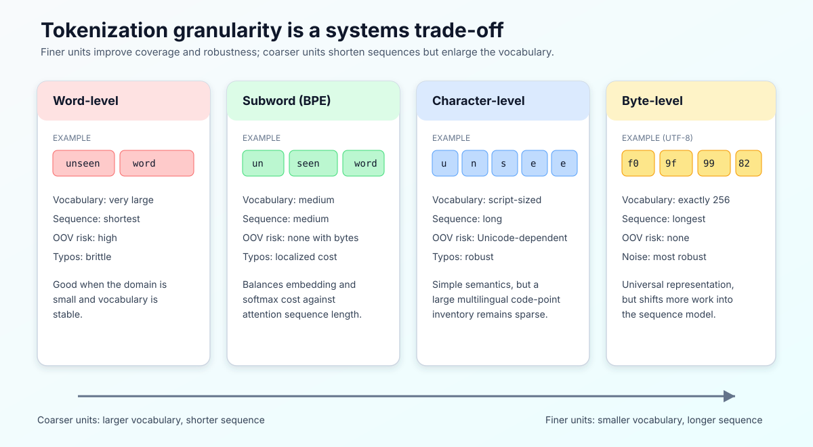
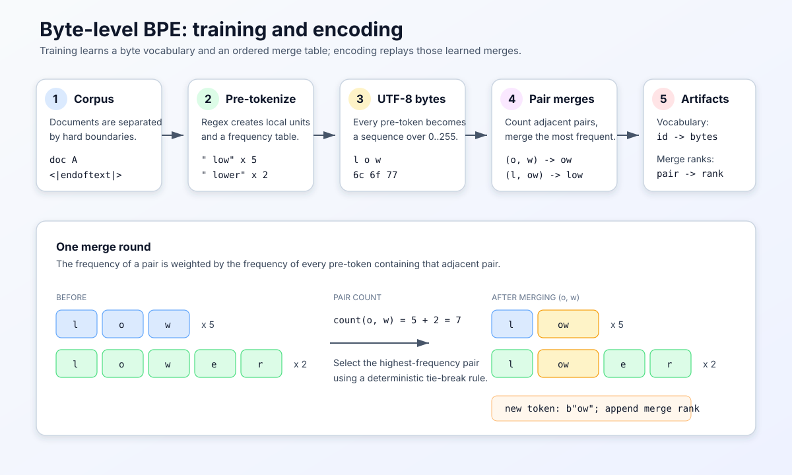

# BPE Tokenizer：从文本表示、压缩算法到语言模型接口

## 文档范围

本文以 Stanford CS336 Assignment 1 的 byte-level BPE 章节为主线，系统说明 BPE tokenizer 的历史背景、问题来源、算法原理、训练与推理流程、工程实现难点、模型计算影响、评估方法及替代方案。

本文是概念教材，不提供可直接提交到作业中的完整实现。原始材料与抽取文本如下：

- [原始作业 PDF](./cs336_assignment1_basics.pdf)
- [按页保留排版的 PDF 文本抽取结果](./cs336_assignment1_basics_extracted.md)

## 1. Tokenizer 在语言模型中的位置

语言模型并不直接接收自然语言字符串。神经网络的输入通常是一串整数，每个整数表示词表中的一个离散符号：

$$ \text{text} \xrightarrow{\text{tokenizer.encode}} (t_1,t_2,\ldots,t_n), \qquad t_i \in \{0,1,\ldots,V-1\}. $$

其中，$V$ 是词表大小，$n$ 是编码后的序列长度。模型通过 embedding table 将每个 token ID 映射为稠密向量，再执行注意力、前馈网络和输出分类。

生成结束后，tokenizer 执行反向映射：

$$ (t_1,t_2,\ldots,t_n) \xrightarrow{\text{tokenizer.decode}} \text{text}. $$

因此，tokenizer 不是无关紧要的文本预处理工具，而是模型定义的一部分。它同时决定：

1. 模型可以无损表示哪些输入；
2. 相同文本会占用多少上下文长度；
3. embedding 与输出层需要多大词表；
4. 模型学习的是词、词根、字符、字节，还是这些单位的混合；
5. 不同语言、拼写和领域文本承担怎样的 token 成本；
6. 训练数据与推理输入之间是否存在表示偏移。

Tokenizer 一旦确定，训练语料、模型 checkpoint 和推理服务都必须使用兼容的词表、special token 定义和切分规则。随意更换 tokenizer 等价于改变模型输入空间。

## 2. 为什么不能直接把“单词”作为 token

### 2.1 词表不可能封闭

词级 tokenizer 将每个完整单词映射到一个 ID。这种方案序列短、语义直观，但无法构造真正封闭的词表。自然语言不断产生新词：

- 人名、地名和机构名；
- 产品型号、版本号和日期；
- 专业术语与化学式；
- 拼写错误和网络用语；
- 不同词形、时态、格和复合词；
- URL、代码、哈希和随机标识符。

若词不在词表中，传统方案只能映射为统一的 `<unk>`。这样会把大量不同字符串压缩成同一个 ID，信息在进入模型之前已经不可逆地丢失。

若通过扩大词表解决覆盖问题，词表又会迅速膨胀。大词表具有三项直接成本：

1. embedding 参数增加；
2. 输出层参数和 logits 计算增加；
3. 长尾 token 的训练样本稀少，表示难以充分学习。

在输入 embedding 与输出 projection 不共享权重时，仅这两部分的参数量近似为：

$$ P_{\text{vocab}} \approx 2Vd_{\text{model}}. $$

若共享权重，则近似为 $Vd_{\text{model}}$。因此，词表大小 $V$ 会直接转化为显存、存储和计算成本。

### 2.2 自然语言具有长尾分布

自然语言中的词频通常近似服从 Zipf 分布：少量词极其常见，大量词极其罕见。完整保存所有低频词会浪费词表容量，而完全丢弃低频词又会产生 OOV（out-of-vocabulary）问题。

一个合理的表示方案应当满足：

- 高频片段可以压缩成较大的 token；
- 低频词仍可拆成更小单位表示；
- 任意输入都具有回退路径；
- 词表容量主要分配给训练语料中真正高频、可复用的模式。

BPE 正是在这一目标下形成的一种折中方案。

## 3. 四种基础粒度及其矛盾

图 1：词级、子词级、字符级与字节级 tokenization 的主要权衡。粒度越粗，序列通常越短，但词表与 OOV 风险越大；粒度越细，覆盖能力越强，但序列更长。

### 3.1 词级

句子 `the tokenizer works` 可以被切成三个 token。优点是序列短、单位直观；缺点是词表庞大且无法覆盖开放世界中的全部字符串。

### 3.2 Unicode 字符级

字符级方案将字符串拆成 Unicode code point。它能组合出大量单词，但 Unicode 字符集合仍然庞大且稀疏。组合字符、规范化形式和 emoji 序列也使“一个可见字符等于一个 code point”这一假设失效。

### 3.3 字节级

任意 Unicode 字符串都可以编码成 UTF-8 字节。每个字节的取值范围固定为 $0$ 到 $255$，因此基础词表只需 256 项，而且不存在 OOV。

代价是序列显著变长。例如，一个 emoji 往往需要 4 个 UTF-8 字节；中文字符通常需要 3 个 UTF-8 字节。更长的序列会增加模型计算，尤其是 self-attention 的主要计算和显存开销随序列长度近似二次增长：

$$ C_{\text{attention}} = O(n^2 d_{\text{model}}). $$

这里的“4 个 UTF-8 字节”是指：UTF-8 使用 4 个连续的 8-bit 数值来编码一个 Unicode code point，而不是说该 emoji 包含 4 个可见字符。UTF-8 是变长编码，不同 code point 使用的字节数不同：

| Unicode code point 范围 | UTF-8 编码长度 | 首字节形式 |
|---|---:|---|
| U+0000–U+007F | 1 字节 | `0xxxxxxx` |
| U+0080–U+07FF | 2 字节 | `110xxxxx` |
| U+0800–U+FFFF，排除代理项 U+D800–U+DFFF | 3 字节 | `1110xxxx` |
| U+10000–U+10FFFF | 4 字节 | `11110xxx` |

例如，emoji `🙂` 对应 Unicode code point U+1F642。其 UTF-8 编码是字节串 `F0 9F 99 82`，也就是十进制序列 `[240, 159, 153, 130]`：

| 层次 | 表示 |
|---|---|
| 可见字符 | `🙂` |
| Unicode code point | U+1F642 |
| UTF-8 字节 | `F0 9F 99 82` |
| Byte-level tokenizer 的初始表示 | `F0`、`9F`、`99`、`82` 四个基础 byte token |

因此，“一个 emoji 需要 4 个 UTF-8 字节”描述的是该字符编码后的底层字节长度。对于纯字节 tokenizer，这四个字节始终对应四个 token；对于 byte-level BPE，它们只是在执行 merge 之前的四个基础 token。如果这一字节序列在训练语料中足够常见，BPE 可能将相邻字节逐步合并，使该 emoji 最终由少于四个 token、甚至一个 token 表示。

上述 4 字节结论只适用于由单个 code point 表示的 emoji。部分可见 emoji 实际上是由多个 code point、变体选择符或零宽连接符组成的 grapheme cluster，例如家庭 emoji 和部分职业 emoji；它们的完整 UTF-8 表示可能远大于 4 字节。

### 3.4 子词级

子词 tokenizer 处于词级与字节级之间：

- 以字节或字符作为无损回退单位；
- 把高频相邻片段合并为较长 token；
- 常见词可能成为一个 token；
- 生僻词可由多个较小 token 组合得到。

BPE 是学习这种子词词表的一种确定性方法。

## 4. BPE 的历史来源与 NLP 变体

### 4.1 原始 Byte Pair Encoding

Byte Pair Encoding 最初是一种数据压缩方法。其基本思想是反复寻找数据中最常见的相邻字节对，用一个新的符号替换该字节对。若某个 pair 大量重复，替换后数据长度会缩短。

原始压缩算法关注的是“减少存储长度”，并不关心语言学边界。

### 4.2 子词 BPE

Sennrich、Haddow 和 Birch 在 2016 年将这一思想用于神经机器翻译中的稀有词表示。算法不再以最终压缩文件为目标，而是把每次合并产生的新符号加入子词词表。

这种适配带来两个结果：

1. 高频字符串片段获得独立 token；
2. 低频词可分解为已知子词，不必全部变成 `<unk>`。

### 4.3 Byte-level BPE

早期 NLP BPE 经常从字符开始。Byte-level BPE 则从 UTF-8 字节开始：

- 初始词表固定包含 256 个字节；
- 任意 Unicode 文本均可表示；
- 合并得到的 token 本质上是字节串；
- 单个 token 不一定能独立解码成合法 Unicode 字符；
- 多个 token 的字节拼接后才保证恢复原文本。

CS336 Assignment 1 采用的正是 byte-level BPE。

## 5. Unicode、UTF-8 与 byte-level BPE

### 5.1 Unicode code point 不是字节

Unicode 为字符分配 code point，例如 `s` 对应 U+0073。UTF-8 再把 code point 编码成一个或多个字节：

- ASCII 字符通常占 1 字节；
- 常见欧洲字符通常占 2 字节；
- 常见中日韩字符通常占 3 字节；
- 许多 emoji 占 4 字节。

因此，下列三个概念必须区分：

| 概念 | 示例 | 作用 |
|---|---|---|
| Unicode 字符 | `牛` | 抽象字符 |
| Unicode code point | U+725B | 字符的整数编号 |
| UTF-8 字节 | `E7 89 9B` | 存储和传输表示 |

Byte-level BPE 的基础符号是最后一列的单个字节，而不是 Unicode code point。

### 5.2 为什么通常使用 UTF-8

UTF-8 具有以下优势：

1. ASCII 文本保持单字节表示，与大量现有文本和协议兼容；
2. 对网页和代码等 ASCII 比例较高的数据通常比 UTF-16、UTF-32 更紧凑；
3. 没有字节序歧义，不需要依赖 big-endian 或 little-endian 解释；
4. 互联网上的文本生态主要采用 UTF-8；
5. 任意 Unicode 字符都能分解为 256 项基础字节词表中的元素。

### 5.3 单个 token 可能不是合法文本

假设某个汉字编码为三个 UTF-8 字节，BPE 可能暂时把它表示为三个 token，也可能把前两个字节合并为一个 token。前两个字节单独解码时是不完整 UTF-8 序列，但它们仍是合法的 tokenizer token。

因此，正确解码顺序是：

1. 根据 token ID 查出每个 token 对应的字节串；
2. 按顺序拼接所有字节串；
3. 对完整字节流执行一次 UTF-8 解码。

逐 token 调用 UTF-8 decode 是错误的，因为 Unicode 字符可能跨越 token 边界。

## 6. BPE 试图解决的核心问题

BPE 实际解决的是一个受词表预算约束的序列压缩问题。

给定训练语料和最大词表大小 $V$，需要选择一组可复用字节串，使语料编码后的 token 序列尽量短，同时保留任意输入的表示能力。

它并不直接优化语言模型 loss，也不保证学到语言学意义上的词素。BPE 使用一个局部、贪心代理目标：

> 每轮合并当前最频繁的相邻 token pair。

若 pair $(a,b)$ 在语料当前表示中出现 $f(a,b)$ 次，将其替换为新 token $ab$，理想情况下可以减少约 $f(a,b)$ 个序列位置。高频 pair 因而具有较高的即时压缩收益。

需要注意：

- 这是贪心过程，不保证全局最优词表；
- 合并结果依赖训练语料；
- 合并结果依赖 pre-tokenization；
- 合并结果依赖 tie-break 规则；
- 相同词表大小不意味着相同 tokenization。

## 7. BPE 训练全流程

图 2：Byte-level BPE 训练由语料边界、pre-tokenization、UTF-8 字节化、频率合并和产物序列化组成。编码阶段不会重新统计频率，而是重放训练得到的 merge 顺序。

### 7.1 输入与产物

训练输入包括：

- 文本语料；
- 目标词表大小 $V$；
- special token 集合；
- pre-tokenization 规则；
- pair 频率相同时的确定性 tie-break 规则。

训练输出通常包括：

1. `vocab`：token ID 到字节串的映射；
2. `merges`：按创建顺序排列的 pair 合并列表；
3. special token 的固定 ID 与字符串定义；
4. tokenizer 配置，例如 normalization 和 pre-tokenizer 版本。

仅保存词表通常不够。编码结果还依赖 merge rank，也就是每条 merge 的优先级。

### 7.2 初始化基础词表

Byte-level BPE 从 256 个单字节 token 开始。若有 $S$ 个不与基础 token 重复的 special token，则初始大小为 $256+S$。

目标词表大小为 $V$ 时，需要执行的 merge 数量通常为：

$$ M = V - 256 - S. $$

每执行一次 merge，就产生一个新的字节串 token，并把对应 pair 追加到 merge 列表。

### 7.3 文档与 special token 分段

`<|endoftext|>` 一类 special token 表示文档边界或控制语义。训练时应把它视为硬边界：

- special token 自身作为一个完整词表项保留；
- 它不参与普通 pair 频率统计；
- 左右两侧不能发生跨边界合并；
- 不同文档末尾与开头不能形成伪 pair。

否则，训练可能学到“文档 A 的结尾 + 文档 B 的开头”这种没有稳定语言意义的 token。

### 7.4 Pre-tokenization

Pre-tokenization 是一次粗粒度切分。它通常通过正则表达式把文本分成单词片段、数字、标点和空白片段。

它有两个作用。

第一，限制 merge 的搜索空间。BPE 只在单个 pre-token 内合并，不跨 pre-token 边界。

第二，把完整语料压缩成“pre-token 到出现次数”的频率表。若 `" text"` 出现 10 次，只需保存一次其字节表示和计数 10；统计内部 pair 时，把贡献乘以 10 即可。

设不同 pre-token 的集合为 $\mathcal{P}$，$c(p)$ 为 pre-token $p$ 的出现次数，$\operatorname{occ}_p(a,b)$ 为 pair $(a,b)$ 在 $p$ 当前表示中的相邻出现次数，则全局 pair 频率为：

$$ f(a,b)=\sum_{p\in\mathcal{P}}c(p)\operatorname{occ}_p(a,b). $$

这解释了为什么 `finditer` 式流式匹配比先构造完整 pre-token 列表更节省内存：训练真正需要长期保存的是频率表，而不是每次出现对应的独立字符串对象。

### 7.5 转换为 UTF-8 字节序列

每个 pre-token 被编码为 UTF-8 字节，并初始表示为单字节 token 序列。

例如，ASCII pre-token `text` 的初始表示是：

| 可见字符 | `t` | `e` | `x` | `t` |
|---|---:|---:|---:|---:|
| 十进制字节 | 116 | 101 | 120 | 116 |
| 十六进制字节 | `74` | `65` | `78` | `74` |

对于非 ASCII 文本，一个可见字符会对应多个初始 token。

### 7.6 统计相邻 pair

对每个不同 pre-token 的当前 token 序列，统计所有相邻 pair，并乘以该 pre-token 的语料频率。

假设：

- `text` 出现 10 次；
- `team` 出现 4 次。

初始 pair 频率包括：

| Pair | 来自 `text` | 来自 `team` | 总计 |
|---|---:|---:|---:|
| `(t, e)` | 10 | 4 | 14 |
| `(e, x)` | 10 | 0 | 10 |
| `(x, t)` | 10 | 0 | 10 |
| `(e, a)` | 0 | 4 | 4 |
| `(a, m)` | 0 | 4 | 4 |

因此，第一轮选择 `(t,e)`，产生新 token `te`。

### 7.7 合并最高频 pair

选中 pair $(a,b)$ 后，所有 pre-token 中相邻的 $a,b$ 被替换成新 token $ab$。

替换必须遵循非重叠原则。例如序列 `a a a` 中 pair `(a,a)` 虽然有两个重叠位置，但一轮替换不能让中间的 `a` 同时参与两次 merge。实际结果取决于约定的扫描方向，训练与编码必须一致。

新 token 被加入词表，pair 被追加到 merges：

| Merge rank | 左 token | 右 token | 新 token |
|---:|---|---|---|
| 0 | `t` | `e` | `te` |
| 1 | `...` | `...` | `...` |

随后重新统计受影响的 pair，并进入下一轮。

### 7.8 确定性 tie-break

多个 pair 可能具有相同最高频率。若 tie-break 不固定，不同进程、Python 版本或数据结构遍历顺序可能生成不同词表。

CS336 作业规定：频率相同时选择字典序更大的 pair。该规则不是所有 BPE 实现的通用标准，而是本作业 tokenizer 格式的一部分。

生产系统也必须明确记录 tie-break，否则无法保证训练可复现。

### 7.9 停止条件

常见停止条件有：

- 词表达到目标大小；
- 已执行预定 merge 数；
- 没有可合并 pair；
- 最高 pair 频率低于阈值；
- 验证集压缩收益不再明显。

CS336 主要使用固定最大词表大小。

## 8. 一个完整但不依赖代码的训练示例

考虑已经 pre-tokenize 的频率表：

| Pre-token | 频率 |
|---|---:|
| `text` | 10 |
| `team` | 4 |

初始状态是单字节 token：

- `text`：`t | e | x | t`
- `team`：`t | e | a | m`

### 第一轮

最高频 pair 是 `(t,e)`，频率为 14。合并后：

- `text`：`te | x | t`
- `team`：`te | a | m`

词表新增 `te`，merges 新增 `(t,e)`。

### 第二轮

当前 pair 为：

- `(te,x)`：10；
- `(x,t)`：10；
- `(te,a)`：4；
- `(a,m)`：4。

最高频率发生并列，因此按 tokenizer 规定的 tie-break 选择其中一个。选择结果会影响后续 merge 路径，这也是 merges 顺序必须作为模型资产保存的原因。

### 关键观察

1. BPE 学到的是语料统计规律，不是预定义词根；
2. 高频 `te` 被合并，是因为压缩收益高，而不是因为它具有独立语义；
3. 语料或 tie-break 改变时，merge 顺序可能改变；
4. 相同最终词表中即使包含相同字节串，merge rank 不同也可能导致不同编码。

## 9. 编码：如何使用已经训练好的 BPE

训练完成后，编码新文本不再统计当前输入中的 pair 频率。编码必须使用训练阶段固定下来的规则。

### 9.1 处理 special token

先识别允许的 special token，并将其作为不可拆分单元。普通文本区域与 special token 区域分开处理。

Special token 的识别存在安全含义。若 API 区分“允许 special token”和“把相同字符串当普通文本”，调用方必须显式指定策略，避免用户输入意外注入控制 token。

### 9.2 执行相同的 pre-tokenization

编码使用的正则、空白处理和 normalization 必须与训练一致。任何差异都会造成分布偏移。

例如，pre-tokenizer 若把前导空格附着到下一个词，则 `hello` 与 ` hello` 可能拥有不同 token。空格不是排版细节，而是词表字节的一部分。

### 9.3 转为 UTF-8 字节

每个普通 pre-token 转成单字节 token 序列。此时任意输入都已经可表示。

### 9.4 按 merge rank 合并

训练产物中的 merge 列表定义一个全序关系。编码时，只有列表中存在的 pair 才能合并，而且优先级由 rank 决定。

重要原则是：

> 编码阶段重放训练得到的 merge 优先级，而不是重新选择当前输入中出现次数最多的 pair。

若重新统计输入频率，同一字符串在不同上下文或 batch 中可能得到不同 tokenization，模型接口将失去确定性。

### 9.5 映射为 token ID

所有合并结束后，每个字节串都在词表中具有唯一 ID，于是得到整数序列。

理想情况下，固定 tokenizer 对相同字符串总是产生相同 token ID 序列。

## 10. 解码与 round-trip

解码步骤是：

1. token ID 查表得到字节串；
2. 将全部字节串按顺序拼接；
3. 对完整字节流执行 UTF-8 解码；
4. 对非法字节序列按约定报错或替换为 U+FFFD。

对所有合法输入文本，若 tokenizer 不执行有损 normalization，应满足：

$$ \operatorname{decode}(\operatorname{encode}(x))=x. $$

需要区分两个事实：

- 任意合法字符串经过 encode 后一定可以 round-trip；
- 任意人为构造的 token ID 序列不一定对应合法 UTF-8。

后者发生时，可使用 Unicode replacement character `�` 表示无法解码的字节。

## 11. Pre-tokenization 为什么不是可有可无

### 11.1 控制词表统计偏好

如果完全允许跨空白和标点合并，BPE 可能学到大量包含偶然上下文的长 token，例如完整短语、标点变体或跨句片段。这些 token 在训练语料中压缩率高，但泛化和复用价值有限。

Pre-tokenization 通过边界注入先验：

- 字母序列倾向于内部合并；
- 数字可按特定宽度分组；
- 标点与单词可以分开；
- 空白可以单独处理或附着到后续词；
- contraction 可以按规则拆分。

这不是纯粹的性能优化，而是在定义 tokenizer 的归纳偏置。

### 11.2 为什么常把空格附着到单词

许多 GPT 风格 tokenizer 会产生类似 `" hello"` 的 token，而不是独立的空格 token 加 `"hello"`。原因在于英文单词大多出现在空格之后，把空格与词合并通常能提高压缩率，并区分句首形式与句中形式。

代价是：

- 同一个可见词可能拥有多个 token 版本；
- 对空白风格敏感；
- 代码缩进和重复空格可能产生不同分词；
- 对不使用空格分词的语言帮助有限。

### 11.3 Pre-tokenizer 是模型格式的一部分

仅共享 `vocab.json` 和 `merges.txt` 并不能完全复现 tokenizer。还需要共享：

- Unicode normalization；
- pre-tokenizer 正则；
- special token 集合；
- special token 匹配优先级；
- 空白与换行规则；
- UTF-8 错误处理；
- merge rank 和 tie-break 约定。

## 12. Special token 的语义

Special token 不仅是罕见字符串，而是控制协议的一部分。常见类型包括：

| 类型 | 作用 |
|---|---|
| BOS | 序列开始 |
| EOS | 序列结束 |
| PAD | batch 补齐 |
| UNK | 未知符号，byte-level BPE 通常不需要 |
| SEP | 片段分隔 |
| MASK | 掩码语言模型目标 |
| FIM | fill-in-the-middle 代码生成控制 |
| Role token | 对话中的 system、user、assistant 边界 |

Special token 应满足：

1. 具有稳定 ID；
2. 编码时不被普通 BPE 拆分；
3. 训练 pair 不跨过其边界；
4. 普通用户文本是否允许触发它必须有明确策略；
5. 模型配置、模板和 tokenizer 配置保持一致。

如果 special token 被误拆，模型看到的控制协议会改变；如果普通文本能意外注入 special token，则可能引发 prompt 边界混淆。

## 13. 词表大小的系统权衡

BPE 词表大小并非越大越好。

### 13.1 较大词表的收益

- 高频词和短语更容易压缩成单 token；
- 平均序列更短；
- 固定 context window 可容纳更多原始文本；
- attention 的二次复杂度可能明显下降。

### 13.2 较大词表的成本

- embedding 和输出 projection 参数增加；
- 每个位置计算 logits 的成本增加；
- 长尾 token 更新次数少；
- 词表文件和 serving 内存增加；
- 容易学习语料特有的长字符串、URL 或噪声；
- 多语言数据不均衡时，词表容量可能被高资源语言占据。

输出层 dense projection 的主要计算近似为：

$$ C_{\text{output}}=O(nVd_{\text{model}}). $$

而 self-attention 近似为 $O(n^2d_{\text{model}})$。增大 $V$ 往往会减小 $n$，因此 tokenizer 选择是在两类成本之间做系统折中。

### 13.3 较小词表的收益与成本

较小词表减少 embedding 和输出层成本，也让每个 token 获得更多训练样本；但它会增加序列长度、attention 成本和长程依赖学习难度。

不存在脱离模型、语料和硬件的唯一最佳词表大小。

## 14. Tokenizer 如何影响有效上下文长度

模型的 context length 通常以 token 数计，而不是字符数或字节数计。

若上下文上限为 $N$，某数据集的平均压缩率为每 token 包含 $C$ 字节，则可容纳的原始文本规模近似为：

$$ B_{\text{context}}\approx N C. $$

同一个 8K context 模型：

- 在英语散文上可能容纳较多单词；
- 在代码、低资源语言或 emoji 密集文本上可能容纳更少语义内容；
- tokenizer 与目标领域不匹配时，有效上下文会显著缩水。

这也是 tokenizer 公平性问题的一部分：不同语言完成同一语义任务可能消耗不同 token 数，从而承担不同推理费用和截断风险。

## 15. 训练阶段的复杂度与性能瓶颈

### 15.1 朴素算法

设所有不同 pre-token 当前长度之和为 $L$，需要执行 $M$ 次 merge。若每轮都完整扫描所有 pre-token 并重新统计 pair，时间复杂度近似为：

$$ O(ML). $$

当语料和词表较大时，这种实现会非常慢。

### 15.2 增量更新

一次 merge 只会改变与被合并位置相邻的 pair。工程实现可维护：

- pair 到全局频率的映射；
- pair 到受影响 pre-token 的倒排索引；
- pre-token 的当前符号序列；
- 可快速取得最大 pair 的数据结构；
- 处理旧 heap entry 的版本或惰性失效机制。

每轮只更新局部受影响 pair，可以避免全量重计。

但是，增量方案的正确性比朴素方案更难保证，常见问题包括：

- 重叠 pair 计数错误；
- 同一 pre-token 内出现多次目标 pair 时更新不完整；
- 旧 priority queue 条目未失效；
- tie-break 不稳定；
- merge 后倒排索引残留；
- 频率减法与加法不对称。

合理开发顺序是先在极小语料上建立可验证的朴素基线，再通过 profiler 确定瓶颈并优化。

### 15.3 可并行与不可并行部分

Pre-tokenization 可以按安全文档边界切分，各进程分别统计局部 pre-token 频率，最后按 key 求和。这是典型的 map-reduce。

全局 BPE merge 具有顺序依赖：

- 第 $k$ 次 merge 改变第 $k+1$ 次的 pair 频率；
- 下一轮必须看到上一轮完成后的全局状态；
- 因而 merge 主循环不容易做粗粒度并行。

并行化重点通常应放在文件读取、special token 分段、正则匹配和局部频率统计。

### 15.4 Chunk boundary 正确性

训练时随意按字节偏移切块可能：

- 切断 UTF-8 多字节字符；
- 切断 pre-token；
- 改变正则匹配结果；
- 让局部统计与整文件统计不一致。

CS336 数据使用 `<|endoftext|>` 分隔文档，因此可在 special token 起点切块。由于本来就禁止跨文档合并，该边界同时满足并行与语义正确性。

编码超大文件时也必须保证 chunk 不切断潜在 token。可按完整 pre-token 或明确边界产出 token，尚未确定的尾部需要保留到下一块。

## 16. 编码阶段的复杂度

最直接的编码方式是对每个 pre-token 依次遍历全部 merges。若 pre-token 长度为 $n$、merge 数为 $M$，最坏情况下会产生较高的 $O(Mn)$ 成本。

高性能实现通常会：

- 把 pair 映射到 merge rank；
- 只考虑当前相邻 pair；
- 使用优先队列选择 rank 最小的可用 pair；
- 通过链表或邻接索引执行局部合并；
- 缓存高频 pre-token 的编码结果；
- 批量处理输入并减少对象分配。

训练和编码是两个不同性能问题：

- 训练关注全语料 pair 统计和多轮全局更新；
- 编码关注对大量独立 pre-token 快速重放固定 merge rank。

## 17. 如何评价 tokenizer

### 17.1 覆盖与可逆性

Byte-level BPE 应对任意合法 Unicode 字符串提供无 OOV 编码，并验证 round-trip：

$$ \operatorname{decode}(\operatorname{encode}(x))=x. $$

测试集合应覆盖：

- ASCII；
- 中文、日文、阿拉伯文等多语言文本；
- combining mark；
- emoji 与零宽连接符；
- NUL 等控制字符；
- 换行、制表符和重复空格；
- 非法 token ID 序列的解码策略；
- special token 与其子串。

### 17.2 压缩率

CS336 使用 bytes/token：

$$ R_{\text{compression}}=\frac{\text{UTF-8 byte count}}{\text{token count}}. $$

该值越高，说明每个 token 平均承载的原始字节越多，序列越短。

压缩率必须分领域和语言报告。只给出单一全局均值可能掩盖低资源语言、代码或噪声文本的明显退化。

### 17.3 Fertility

Fertility 常定义为每个词平均产生多少 token：

$$ F=\frac{\text{token count}}{\text{word count}}. $$

它适合空格分词语言，但对中文或代码不够中立。跨语言比较时，bytes/token、characters/token 和 normalized token count 应结合使用。

### 17.4 吞吐与内存

需要分别测量：

- 训练 pre-tokenization 吞吐；
- merge 训练耗时；
- encode bytes/s；
- decode bytes/s；
- 峰值内存；
- 多进程加速比；
- 小文本延迟与大文件吞吐。

### 17.5 下游模型指标

更高压缩率不必然带来更低语言模型 loss。完整评价还应包含：

- 相同原始数据量下的 validation loss；
- 相同 token 预算下的 validation loss；
- 相同计算预算下的模型质量；
- 长上下文任务表现；
- 拼写扰动和噪声鲁棒性；
- 多语言公平性。

## 18. BPE 的典型失败模式

### 18.1 把 BPE token 当作语言学词素

BPE merge 只由频率驱动。它可能学到词根和后缀，也可能学到半个词、标点组合、空格前缀或 UTF-8 字节片段。不能把每个 token 都解释成具有独立语义的语言单位。

### 18.2 训练与编码的 pre-tokenizer 不一致

即使 vocab 和 merges 相同，正则、normalization 或 special token 规则不同，也会产生不同 token ID。

### 18.3 编码时重新计算 pair 频率

训练阶段的频率用于学习 merge rank；编码阶段必须使用固定 rank。重新统计会让 tokenization 依赖输入集合。

### 18.4 逐 token UTF-8 解码

单个 byte-level token 可能只是一个 Unicode 字符的部分字节。必须先拼接全部 token bytes，再统一 decode。

### 18.5 跨 pre-token 或文档边界合并

这会生成偶然上下文 token，破坏训练与编码的一致性，也可能跨越 special token 控制边界。

### 18.6 忽略重叠 pair

像 `aaaa` 这样的序列包含重叠 pair。计数、替换和增量更新必须采用一致的非重叠规则。

### 18.7 Tie-break 不确定

如果依赖 hash map 的遍历顺序，训练结果可能不可复现，参考测试也会失败。

### 18.8 Unicode normalization 不一致

视觉相同的文本可能具有不同 code point 序列。例如某些带重音字符既可表示为预组合字符，也可表示为基本字符加 combining mark。

若执行 NFC/NFKC normalization，压缩和一致性可能改善，但原始文本 round-trip 可能改变；若不 normalization，则视觉等价文本可能产生不同 token。该选择必须显式记录。

### 18.9 词表过度记忆训练数据

过大的词表可能包含长 URL、模板字符串、隐私片段或重复噪声。Tokenizer 训练本身也需要数据治理和隐私检查。

## 19. BPE 的替代方案

### 19.1 词级 tokenizer

**原理**：空白、标点或语言学分词后，每个词对应一个 ID。

**优点**：

- 序列短；
- token 易解释；
- 对封闭领域和固定词典可高效。

**缺点**：

- OOV 严重；
- 词表巨大；
- 形态丰富语言产生大量词形；
- 拼写错误和新实体脆弱。

### 19.2 字符级 tokenizer

**原理**：每个 Unicode code point 作为 token。

**优点**：

- 不依赖词边界；
- 对拼写变化较稳健；
- 实现概念简单。

**缺点**：

- Unicode 词表仍较大；
- 序列长；
- grapheme cluster 可能由多个 code point 构成；
- 多语言字符频率极不均衡。

### 19.3 纯字节模型

**原理**：不做 BPE merge，始终使用 256 个字节 token。

**优点**：

- 完全无 OOV；
- tokenizer 极简单；
- 对噪声、任意文件和多语言统一；
- 词表相关参数极小。

**缺点**：

- 序列最长；
- attention 成本高；
- 模型需要自己学习字节到字符、字符到词的层次结构；
- 固定 token context 可承载的语义内容较少。

ByT5 等模型探索了这种方向。

### 19.4 WordPiece

**原理**：同样构造子词词表，但候选合并通常依据似然提升或经过归一化的 pair score，而不是直接使用原始 pair 频率。BERT 系列常使用 WordPiece。

**优点**：

- 目标更接近语言模型似然；
- 高频单符号不会仅凭边际频率垄断所有 merge；
- 在经典 BERT 生态中成熟。

**缺点**：

- 训练逻辑比频率 BPE 更复杂；
- 传统版本仍可能依赖 `<unk>`；
- 不同实现的 score 和边界约定差异较大。

### 19.5 Unigram Language Model

**原理**：先建立较大的候选子词集合，再迭代删除对语料似然贡献较小的 token。一个字符串可能存在多种合法切分，通常选择概率最大的切分。

**优点**：

- 具有明确概率模型；
- 可保留多种分词路径；
- 支持 subword regularization，在训练时采样不同切分；
- 删除式训练有机会修正早期选择。

**缺点**：

- 训练更复杂；
- 需要维护候选集合和概率估计；
- 编码常需要动态规划；
- 结果与 seed vocabulary 构造密切相关。

SentencePiece 常用 Unigram，也支持 BPE。SentencePiece 是 tokenizer 框架，不是单一算法。

### 19.6 Byte fallback

**原理**：主要词表使用字符级或子词级 token；遇到无法表示的字符时，回退到字节 token。

**优点**：

- 常见文本保持较自然的子词；
- 任意 Unicode 输入仍无 OOV；
- 不必让全部训练过程都在原始字节层工作。

**缺点**：

- 主词表与 fallback 规则更复杂；
- 生僻字符可能突然膨胀为多个 token；
- 不同实现的 fallback 标记兼容性较差。

### 19.7 形态学 tokenizer

**原理**：借助词干、词缀、复合词和语言规则切分。

**优点**：

- token 更接近语言学结构；
- 对形态丰富语言可能更高效；
- 可解释性较好。

**缺点**：

- 依赖语言和外部规则；
- 多语言统一困难；
- 新词、代码和噪声文本仍需回退；
- 工程维护成本高。

### 19.8 Tokenization-free 或 learned segmentation

CANINE、Charformer、MegaByte 等方向尝试直接从字符或字节建模，或在模型内部学习下采样与局部分组。

**优点**：

- 减少固定 tokenizer 的语言偏置；
- 对拼写、噪声和开放字符集更鲁棒；
- segmentation 可与模型目标联合学习。

**缺点**：

- 序列计算更重；
- 架构更复杂；
- 训练与 serving 基础设施不如标准 subword 模型成熟；
- 很难直接复用以 token 为中心的现有 checkpoint 和数据管线。

## 20. 方案对比

| 方案 | OOV | 词表大小 | 序列长度 | 训练复杂度 | 多语言 | 主要风险 |
|---|---|---:|---:|---:|---|---|
| 词级 | 高 | 很大 | 短 | 低 | 较差 | 长尾与 `<unk>` |
| 字符级 | 较低 | 中到大 | 长 | 低 | 中等 | Unicode 稀疏性 |
| 纯字节 | 无 | 256 | 最长 | 最低 | 强 | 模型计算增加 |
| Byte-level BPE | 无 | 中等 | 中等 | 中等 | 强 | 语料偏置、边界规则 |
| WordPiece | 取决于 fallback | 中等 | 中等 | 中等 | 中等 | 实现差异、`<unk>` |
| Unigram | 取决于基础符号 | 中等 | 中等 | 较高 | 强 | 候选集与概率训练 |
| 形态学 | 取决于 fallback | 中等 | 较短 | 高 | 较差 | 语言专用规则 |
| Tokenization-free | 无或很低 | 很小 | 很长 | 转移到模型 | 强 | 训练与推理成本 |

## 21. 如何选择 tokenizer

### 21.1 通用大语言模型

通常需要：

- 无 OOV；
- 多语言覆盖；
- 代码和结构化文本支持；
- 可接受的平均序列长度；
- 成熟高吞吐实现。

Byte-level BPE、带 byte fallback 的 BPE/Unigram 是常见选择。

### 21.2 单语言封闭领域

若词典稳定且领域严格受控，词级或较大子词词表可能提供更短序列。但仍应为实体、编号和拼写错误设计回退机制。

### 21.3 代码模型

需要重点评估：

- 空格与缩进；
- 换行符；
- 标识符分解；
- 数字分组；
- 常见操作符；
- 多语言代码与自然语言注释；
- fill-in-the-middle special token。

代码 tokenizer 的压缩目标与普通散文不同，直接复用自然语言词表可能造成较高 token fertility。

### 21.4 多语言模型

仅看全局压缩率会偏向高资源语言。应分别报告各语言的：

- bytes/token；
- characters/token；
- 同义平行文本 token 数；
- 截断率；
- 下游质量；
- 单位请求成本。

训练语料配比和词表预算共同决定不同语言获得多少高频 token。

## 22. 工程验证清单

### 22.1 训练正确性

- 初始 256 个字节均存在；
- special token ID 稳定且不参与普通 merge 统计；
- 不跨 pre-token 和文档边界合并；
- pair 频率乘以 pre-token 出现次数；
- 重叠 pair 处理规则一致；
- tie-break 确定；
- 每轮只新增一个 token；
- merge 数与目标词表大小一致；
- 小语料结果可手算复核；
- 朴素版与优化版结果逐轮一致。

### 22.2 编码正确性

- 训练和编码使用相同 pre-tokenizer；
- special token 优先于普通文本匹配；
- 仅应用已学习 merge；
- merge 优先级由 rank 决定；
- 同一输入编码确定；
- streaming 与整段编码结果一致；
- 不同 chunk 大小不改变结果。

### 22.3 解码正确性

- 先拼接字节再执行 UTF-8 decode；
- 合法文本满足 round-trip；
- 非法 token ID 有明确错误；
- 非法 UTF-8 有明确 replacement 或 strict 策略；
- special token 是否原样输出具有明确约定。

### 22.4 性能验证

- 分离 I/O、regex、pair 统计、merge 更新和序列化耗时；
- 报告 bytes/s，而不只报告总时间；
- 记录峰值内存；
- 对小、中、大语料测量扩展趋势；
- 验证 multiprocessing 的进程通信成本；
- 优先优化 profiler 证实的瓶颈。

## 23. 最重要的概念辨析

### BPE “训练”是否训练神经网络

不是。BPE 训练是离散统计过程，产物是词表和 merge 顺序，不包含梯度下降。

### Token 是否等于单词

不等于。Token 可能是完整单词、词的一部分、前导空格加词、标点串、单个字节或不完整 UTF-8 片段。

### Byte-level 是否意味着每个 token 都只有一个字节

不意味着。初始 token 是单字节，BPE merge 后的 token 可以包含任意长度字节串。

### 词表相同是否意味着编码相同

不一定。还需要相同的 merge rank、pre-tokenization、normalization 和 special token 规则。

### 压缩率最高是否一定最好

不一定。Tokenizer 还影响输出层成本、低频 token 学习、多语言公平性、鲁棒性和下游 loss。

### BPE 是否保证最优压缩

不保证。它是逐轮选择当前最高频 pair 的贪心算法。

## 24. 总结

BPE tokenizer 的本质可以概括为：

> 以可完全覆盖输入的细粒度符号为起点，在有限词表预算下，把训练语料中高频、可复用的相邻片段逐步提升为独立 token，从而用适度增大的词表换取更短的模型输入序列。

Byte-level BPE 进一步用 UTF-8 字节作为基础符号，消除了 OOV，同时保留 BPE 对高频模式的压缩能力。它成功的原因不是完美地恢复了语言学词素，而是在以下矛盾之间取得了实用平衡：

- 开放字符集与有限词表；
- 短序列与小输出空间；
- 压缩效率与泛化能力；
- 语言无关表示与语料统计偏置；
- 简单确定性算法与高吞吐工程实现。

理解 BPE 时，最关键的不是记住“反复合并最高频 pair”这一句话，而是理解 tokenizer 如何把原始文本转换为模型的计算单位，以及每一个边界规则如何改变模型最终看到的数据分布。

## 参考资料

1. Stanford CS336, *Assignment 1: Basics*, Section 2, Byte-Pair Encoding Tokenizer.
2. Philip Gage, “A New Algorithm for Data Compression,” *C Users Journal*, 1994.
3. Rico Sennrich, Barry Haddow, Alexandra Birch, “Neural Machine Translation of Rare Words with Subword Units,” ACL 2016.
4. Changhan Wang, Kyunghyun Cho, Jiatao Gu, “Neural Machine Translation with Byte-Level Subwords,” 2019.
5. Alec Radford et al., *Language Models are Unsupervised Multitask Learners*, 2019.
6. Taku Kudo, John Richardson, “SentencePiece: A Simple and Language Independent Subword Tokenizer and Detokenizer for Neural Text Processing,” EMNLP 2018.
7. Taku Kudo, “Subword Regularization: Improving Neural Network Translation Models with Multiple Subword Candidates,” ACL 2018.
8. Xue et al., “ByT5: Towards a Token-Free Future with Pre-trained Byte-to-Byte Models,” TACL 2022.
