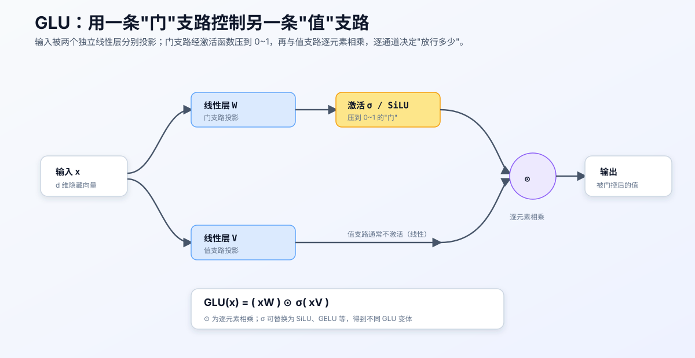
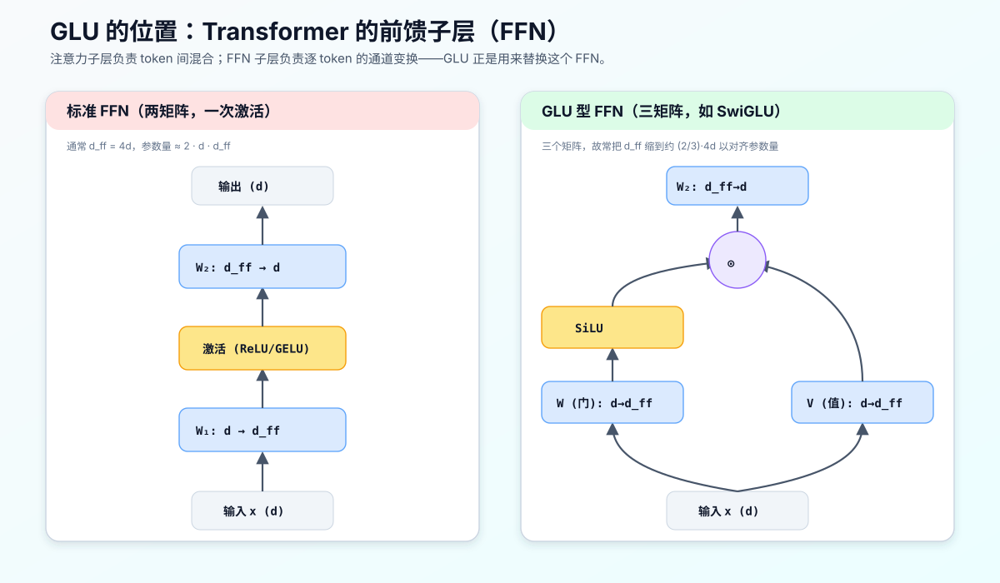
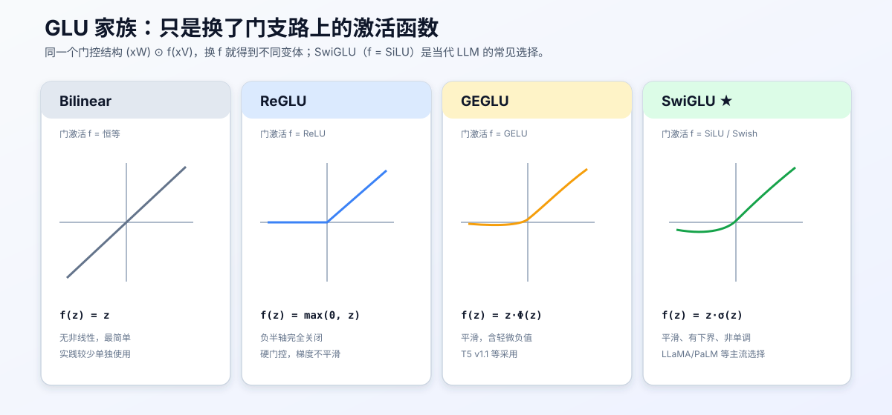

# GLU 门控线性单元：原理、变体，以及它在 LLM 中的位置

## 0. 本文目标与阅读方式

这份讲义系统讲清楚 **GLU（Gated Linear Unit，门控线性单元）**：它是什么、为什么有效、有哪些变体，以及最关键的一个实用问题——**它在大语言模型里到底被放在什么位置、替换掉了什么**。

阅读顺序建议：

1. 第 1–2 节：从"门控"这个核心直觉出发，给出 GLU 的定义与公式；
2. 第 3 节：回答你最关心的问题——GLU 在 LLM 中的位置（前馈子层 FFN）；
3. 第 4–5 节：GLU 家族（ReGLU/GEGLU/SwiGLU 等）与参数量对齐的工程细节；
4. 第 6 节起：为什么它有效、历史脉络、优缺点与相关设计。

本讲义与同目录的 [prenorm_vs_postnorm_explained.md](./prenorm_vs_postnorm_explained.md)、[byte_level_bpe_worked_example.md](./byte_level_bpe_worked_example.md) 属于同一套 CS336 学习笔记。上一篇讲"归一化放在哪里"，这一篇讲"前馈子层内部怎么算"，两者都作用在同一个 Transformer 层里。

> 说明：本文是概念讲解，不含任何作业实现代码。文中 `(xW) ⊗ σ(xV)` 等是数学表达式，用于解释原理，而非可直接粘贴的作业答案。

---

## 1. 核心直觉：什么是"门控"

先抛开公式。神经网络里的**门控（gating）**是一个非常朴素的想法：**用一路信号去控制另一路信号能通过多少**。

打一个比方：水管里的水流是"值"，水龙头开合是"门"。门开到 0，水全被挡住；门开到 1，水全放行；门开到 0.3，放行三成。门控机制就是让网络**学会**在每个通道上开多大的水龙头。

这个思想在深度学习里由来已久：

- LSTM / GRU 用输入门、遗忘门、输出门控制信息的记忆与遗忘；
- 注意力机制某种意义上也是一种软门控（用权重决定关注多少）。

GLU 把这个思想用到最简洁的形式：**两条并行的线性投影，一条当"值"，一条经激活函数变成 0~1 的"门"，二者逐元素相乘。**

---

## 2. GLU 的定义

### 2.1 基本公式

设输入向量为 $x$（$d$ 维）。GLU 用两个**独立的**线性层把它投影成两路，再让其中一路经过激活函数 $\sigma$（原始 GLU 用 sigmoid），最后逐元素相乘：

$$ \mathrm{GLU}(x) = (xW + b) \otimes \sigma(xV + c) $$

其中：

- $W, V$ 是两个**不共享参数**的权重矩阵，$b, c$ 是偏置；
- $\sigma$ 是激活函数，原始论文用 sigmoid，把门压到 $(0,1)$；
- $\otimes$ 表示**逐元素相乘**（Hadamard 积），不是矩阵乘法。

直观理解：$xW$ 是"值"，$\sigma(xV)$ 是"门"。门的每个分量落在 0~1 之间，逐通道地决定对应的值分量能通过多少。

下图把这条数据流画出来：

### 2.2 与普通"线性层 + 激活"的区别

普通前馈的一层是 $\mathrm{act}(xW)$：**先线性、再激活**，激活直接套在信息主路上。

GLU 是 $(xW) \otimes \sigma(xV)$：激活**不套在主路上**，而是套在**另一条支路**上生成门，再回来调制主路。差别在于：

- 普通激活对每个神经元是**固定的、逐点的**非线性；
- GLU 的门是**输入依赖的、乘性的**调制——同一个值通道，在不同输入下可以被放大或抑制。

这种"乘性交互"让网络能表达更丰富的条件关系，这是 GLU 相比单一激活的核心增益。

---

## 3. GLU 在 LLM 中的位置：前馈子层（FFN）

这是本文的重点问题。答案是：**GLU 几乎总是被用来替换 Transformer 层里的前馈子层（FFN，也叫 MLP）**。

### 3.1 先回忆 Transformer 层的两个子层

一个 Transformer 层由两个子层串联：

1. **自注意力子层**：负责 **token 与 token 之间**的信息混合（"横向"看整个序列）；
2. **前馈子层（FFN）**：对**每个 token 独立地**做一次通道维度的非线性变换（"纵向"加工单个位置的表示）。

GLU 作用的是**第二个**——前馈子层。注意力子层一般不用 GLU。

### 3.2 标准 FFN 长什么样

原始 Transformer 的 FFN 是"升维 → 激活 → 降维"的两矩阵结构：

$$ \mathrm{FFN}(x) = \big(\mathrm{act}(xW_1 + b_1)\big) W_2 + b_2 $$

其中中间隐藏维度 $d_{ff}$ 通常取 $4d$（$d$ 是模型宽度）。激活函数早期用 ReLU，后来常用 GELU。

### 3.3 用 GLU 替换后的 FFN

把 FFN 换成 GLU 型结构后，变成**三个矩阵**：一个门投影 $W$、一个值投影 $V$、一个降维投影 $W_2$：

$$ \mathrm{FFN}_{\mathrm{GLU}}(x) = \Big( (xW) \otimes \sigma(xV) \Big) W_2 $$

现代实现通常省略偏置项。下图并排对比标准 FFN 与 GLU 型 FFN 的结构：

### 3.4 为什么是 FFN，而不是别处

- FFN 占了 Transformer **绝大部分参数量**（约 2/3），是模型容量的主要载体，因此在这里提升表达力性价比最高；
- FFN 是**逐 token 独立**的，替换成 GLU 不影响注意力的序列建模逻辑，改动局部、风险可控；
- 大量实验（尤其 Noam Shazeer 2020 年的 *GLU Variants Improve Transformer*）表明，在 FFN 处用 GLU 变体能在相同算力下稳定提升质量。

> 一句话记住位置：**GLU = 更好用的 FFN**。当你听到 LLaMA、PaLM 用了 "SwiGLU"，指的就是它们把前馈子层换成了 SwiGLU 型的门控前馈。

---

## 4. GLU 家族：换激活函数就得到不同变体

GLU 的门控结构是固定的 $(xW) \otimes f(xV)$，**只要替换门支路上的激活函数 $f$，就得到不同变体**。这正是 Shazeer 论文的核心观察。

| 变体 | 门激活 $f$ | 公式（省略偏置） | 典型采用者 |
|---|---|---|---|
| Bilinear | 恒等 | $(xW)\otimes(xV)$ | 少见 |
| ReGLU | ReLU | $(xW)\otimes\mathrm{ReLU}(xV)$ | 部分模型 |
| GEGLU | GELU | $(xW)\otimes\mathrm{GELU}(xV)$ | T5 v1.1 等 |
| **SwiGLU** | **SiLU/Swish** | $(xW)\otimes\mathrm{SiLU}(xV)$ | **LLaMA、PaLM 等主流 LLM** |

其中 SiLU（也叫 Swish）定义为：

$$ \mathrm{SiLU}(z) = z \cdot \sigma(z) $$

它平滑、有下界、非单调，实践中综合表现最好，因此 **SwiGLU** 成为当代大模型的近乎标准选择。下图对比四种门激活的形状：

> 有趣的一点：Shazeer 在论文结尾半开玩笑地把这些改进归因于"神的恩赐（divine benevolence）"，因为理论上并没有完全说清为什么门控一定更好——它主要是**强实验证据**驱动的设计选择。

---

## 5. 关键工程细节：参数量对齐（2/3 规则）

这是初学者最容易踩的坑，必须单独讲。

标准 FFN 只有 2 个矩阵（$W_1, W_2$），而 GLU 型 FFN 有 3 个矩阵（$W, V, W_2$）。如果保持中间维度 $d_{ff}$ 不变，GLU 版本会平白**多出约 50% 的 FFN 参数**，这样比较就不公平了。

工程上的标准做法是：**把 GLU 的隐藏维度缩小到约 $\tfrac{2}{3}$**，使总参数量与标准 FFN 对齐。也就是：

$$ d_{ff}^{\mathrm{GLU}} \approx \frac{2}{3} \times d_{ff}^{\mathrm{standard}} = \frac{2}{3}\times 4d = \frac{8}{3}d $$

这就是为什么在 LLaMA 等模型里，看到 FFN 隐藏维度不是整齐的 $4d$，而是类似 $\tfrac{8}{3}d$ 再向上取整到某个对硬件友好的倍数。**"三矩阵 + 2/3 缩放"这一对组合，是 SwiGLU 落地的标准配方。**

这样对齐之后，GLU 变体的增益才是"在相同参数/算力预算下"的真实增益，而非靠堆参数换来的。

---

## 6. 为什么 GLU 有效：几个角度的解释

GLU 缺乏一个被普遍接受的严格理论，但有几个相互印证的直觉：

1. **乘性交互增强表达力**：普通 FFN 只有加性组合 + 逐点非线性；GLU 引入了 $xW$ 与 $xV$ 的**乘性**交互，让模型能表达"当某特征出现时才放行另一特征"这类条件逻辑，函数类更丰富。
2. **动态、数据依赖的稀疏性**：门 $\sigma(xV)$ 会对不同输入关闭不同通道，相当于一种**软性、可学习的稀疏门控**，比固定激活更灵活。
3. **更平滑的梯度**：SwiGLU/GEGLU 的门激活平滑可导，配合门控的乘性结构，往往带来更好的优化行为。
4. **经验最优**：最终它流行的最硬理由是——在受控对比实验里，SwiGLU 在相同预算下稳定优于 ReLU/GELU FFN，且已被 LLaMA、PaLM 等大规模验证。

---

## 7. 历史脉络

- **2016，Dauphin 等，*Language Modeling with Gated Convolutional Networks***：首次提出 GLU，用在卷积语言模型里，门用 sigmoid。
- **2017，Vaswani 等，Transformer**：FFN 用 ReLU，尚无门控。
- **2020，Shazeer，*GLU Variants Improve Transformer***：系统对比 ReGLU/GEGLU/SwiGLU/Bilinear，指出它们在 T5 上优于标准 FFN，SwiGLU/GEGLU 尤佳。
- **2022 起，PaLM、LLaMA 等**：SwiGLU 成为大模型前馈子层的事实标准，与 Pre-Norm、RMSNorm、RoPE 一起构成现代 LLM 的"标准四件套"。

---

## 8. 优缺点与取舍

**优点**

1. 相同参数/算力预算下，质量通常优于标准 FFN；
2. 改动局部（只换 FFN），与注意力、归一化等正交，易于集成；
3. 已被大规模工业实践反复验证，风险低。

**代价与注意点**

1. **三个矩阵**：实现上多一个投影，需配合 2/3 缩放才能公平对齐参数量；
2. **访存/kernel 复杂度略增**：多一路投影和一次逐元素乘，需要高效实现才能不拖慢；
3. **缺乏严格理论**：增益主要靠经验证据，不是从第一性原理推导出来的；
4. 门支路激活的选择（SiLU vs GELU）对最终质量有影响，需按经验选取。

---

## 9. 与相关设计的关系（横向澄清）

为避免概念混淆，明确几个"正交"的维度：

- **GLU vs 激活函数**：SiLU、GELU 本身是**逐点激活函数**；GLU 是一种**门控结构**。SwiGLU = GLU 结构 + SiLU 门激活，二者是"结构"与"零件"的关系。
- **GLU vs Pre/Post-Norm**：前者决定 FFN 内部怎么算，后者决定归一化放在子层前还是后（见 [prenorm_vs_postnorm_explained.md](./prenorm_vs_postnorm_explained.md)），二者独立，可自由组合。
- **GLU vs MoE**：MoE（专家混合）是在 FFN 层做**稀疏路由**，选择性激活多个专家 FFN；GLU 是把**单个** FFN 换成门控形式。二者可以叠加：每个专家本身也能是 SwiGLU。

---

## 10. 小结：一页纸记住 GLU

1. **是什么**：门控线性单元，$\mathrm{GLU}(x) = (xW) \otimes \sigma(xV)$——一条"值"支路被一条"门"支路逐元素调制。
2. **用在哪**：Transformer 的**前馈子层 FFN**，用来替换"升维→激活→降维"的标准 MLP；注意力子层不用它。
3. **家族**：换门激活即得变体，**SwiGLU（门用 SiLU）是当代 LLM 主流**。
4. **工程配方**：三矩阵结构 + 隐藏维度缩到约 $\tfrac{2}{3}$，以对齐参数量。
5. **为什么流行**：乘性交互 + 动态门控带来更强表达力，且在相同预算下经验质量更优，已被 LLaMA/PaLM 等大规模验证。

配套三张图对应三个层次：
[门控机制](./images/glu_gating_mechanism.svg) → [在 FFN 中的位置](./images/glu_ffn_variants.svg) → [GLU 家族](./images/glu_activation_family.svg)。

---

## 参考文献（用于延伸阅读）

1. Dauphin et al., *Language Modeling with Gated Convolutional Networks*, 2016（GLU 提出）。
2. Vaswani et al., *Attention Is All You Need*, 2017（标准 FFN）。
3. Shazeer, *GLU Variants Improve Transformer*, 2020（ReGLU/GEGLU/SwiGLU 系统对比）。
4. Ramachandran et al., *Searching for Activation Functions*, 2017（Swish/SiLU）。
5. Hendrycks & Gimpel, *Gaussian Error Linear Units (GELUs)*, 2016（GELU）。
6. Touvron et al., *LLaMA*, 2023（SwiGLU 的工业实践）。
