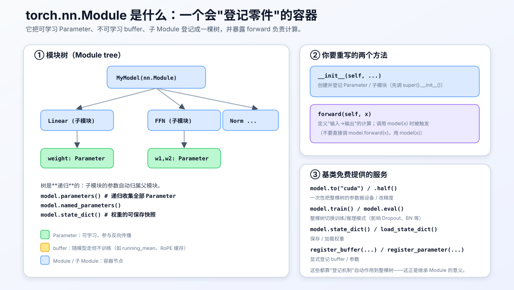
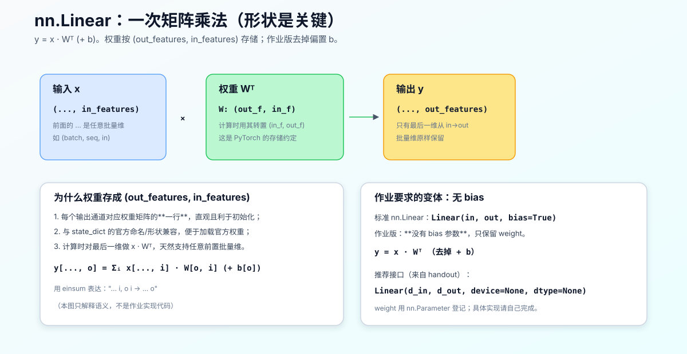

# torch.nn.Module 与 nn.Linear：原理、接口与背景

## 0. 本文目标与边界

这份讲义解释两个 PyTorch 里最基础、也最容易"用了很久却没真正搞懂"的东西：

1. **`torch.nn.Module`**：所有神经网络组件的基类，它到底替你做了什么；
2. **`nn.Linear`**：最常用的一层——全连接/线性层，它的计算、形状约定与参数。

背景动机来自 CS336 assignment1 的一个 deliverable：让你实现一个继承自 `torch.nn.Module`、且**去掉 bias** 的 `Linear`。要写好它，前提是真正理解上面两个概念。

> 边界说明：本文只讲**概念、原理、接口与背景**，用于帮助理解。它**不包含**作业要交的 `Linear` 实现代码——那是 handout 要求你自己完成的部分。文中出现的少量代码是 PyTorch 既有 API 的用法示例或数学语义说明，不是作业答案。

本讲义与同目录其它 CS336 笔记同属一套学习笔记，符号风格一致。

---

## 1. 先建立大图：为什么需要 `nn.Module`

写神经网络时，你会遇到一堆反复出现的琐事：

- 有一批**可学习参数**（权重、偏置），要能被优化器找到、被反向传播更新；
- 有些张量**跟着模型走但不训练**（如 BatchNorm 的滑动均值、RoPE 的频率缓存）；
- 模型是**嵌套**的：一个 Transformer 里有很多层，每层里又有注意力、FFN、norm；
- 要能一键**保存/加载权重**、把整个模型**搬到 GPU**、在**训练/推理模式**间切换。

如果每个组件都手写这些管理逻辑，会重复且易错。`nn.Module` 就是把这些**通用管理能力**一次性封装好的基类：你只要继承它、按约定登记参数和子模块，这些能力就自动获得。

一句话：**`nn.Module` 是一个"会自动登记零件、并对整棵模型树统一提供服务"的容器基类。**

---

## 2. `torch.nn.Module` 的解剖



### 2.1 它登记三类东西

当你在 `__init__` 里给 `self` 赋值时，Module 会**根据类型自动登记**：

| 你写的 | 被登记为 | 特点 |
|---|---|---|
| `self.weight = nn.Parameter(...)` | **Parameter** | 可学习，自动进 `parameters()`，参与反向传播 |
| `self.register_buffer("freqs", t)` | **buffer** | 跟模型走（能 `.to(cuda)`、进 `state_dict`），但**不训练** |
| `self.ffn = SomeModule(...)` | **子 Module** | 递归归属，其参数自动算作父模块的参数 |

这套"赋值即登记"的机制，是通过 Module 重写了 `__setattr__` 实现的——你不需要关心细节，但要知道：**只有用 `nn.Parameter` 包起来的张量才会被当作可学习参数**。直接 `self.w = torch.randn(...)`（普通张量）不会被登记，优化器也就找不到它，这是新手最常见的 bug。

### 2.2 它是一棵递归的树

模型是嵌套的，Module 因此是**树形**结构：父模块持有子模块，子模块的参数自动"上浮"归属父模块。所以：

```python
for p in model.parameters():      # 递归拿到全模型所有可学习参数
    ...
optimizer = torch.optim.AdamW(model.parameters(), lr=...)  # 一行喂给优化器
```

`model.parameters()`、`model.named_parameters()`、`model.state_dict()` 都是**对整棵树递归**收集的结果——这正是嵌套登记带来的红利。

### 2.3 你只需重写两个方法

- **`__init__(self, ...)`**：创建并登记参数、子模块。**第一件事必须调用 `super().__init__()`**，否则 Module 内部用于登记的字典还没初始化，赋值参数会报错。
- **`forward(self, x)`**：定义"输入 → 输出"的实际计算。

> 关键约定：**调用时写 `model(x)`，不要写 `model.forward(x)`。** 因为 `nn.Module.__call__` 在调用 `forward` 前后还会处理 hooks 等机制；`model(x)` 会触发 `__call__` → 再进 `forward`。直接调 `forward` 会绕过这些。

### 2.4 基类免费提供的服务

继承 Module 后，下面这些**不用你写**就能用，且都作用于整棵树：

```python
model.to("cuda")          # 整个模型的参数/buffer 搬到 GPU
model.half()              # 改精度
model.train() / model.eval()   # 切换训练/推理模式（影响 Dropout、BatchNorm）
sd = model.state_dict()   # 导出权重快照（有序字典）
model.load_state_dict(sd) # 加载权重
```

这就是"继承 `nn.Module`"真正的价值：**用登记换服务**。

> **推论：什么时候该用 `nn.Module` 类，什么时候写成普通函数？** 既然 Module 的价值是"管理需要随模型走的状态"，判断标准就很清晰：
>
> 1. **有可学习参数（`nn.Parameter`）→ 用类**：如 `Linear`（weight）、`Embedding`、`RMSNorm`（增益 $g$）、`SwiGLU`（三个子 Linear）。这些需要被优化器更新、进 `state_dict`。
> 2. **有需要随模型走的持久/半持久状态（`buffer`）→ 也用类**：如 `RotaryPositionalEmbedding`——它**没有可学习参数**，但有 `cos/sin` 缓存需要 `register_buffer`、随 `.to(device)` 搬运，所以仍写成类。
> 3. **两者都没有、纯输入→输出的计算 → 写成函数**：如 `silu`、`softmax`、`scaled_dot_product_attention`。它们无状态、不保留任何跨调用信息，套一层 `nn.Module` 只是徒增样板。
>
> 一句话：**有状态（参数或 buffer）用类，纯计算用函数。** 注意"有没有可学习参数"不是唯一标准——RoPE 就是"无参数但有 buffer 故用类"的典型边界情况。

### 2.5 `nn.Module` 常用接口速查

按用途分组，常用的接口如下（大多**由基类提供、直接用**，无需自己写）：

**A. 你通常要重写的**

| 接口 | 作用 | 备注 |
|---|---|---|
| `__init__(self, ...)` | 创建并登记参数/子模块 | 第一行必须 `super().__init__()` |
| `forward(self, x)` | 定义前向计算 | **别直接调**，用 `module(x)` 触发 |

**B. 登记零件（在 `__init__` 里用）**

| 接口 | 作用 |
|---|---|
| `nn.Parameter(tensor)` | 声明可学习参数（赋给 `self.xxx` 即登记） |
| `self.register_buffer(name, tensor)` | 登记随模型走但不训练的张量（如 RoPE 频率、BN 均值） |
| `self.register_parameter(name, param)` | 显式登记参数（等价于属性赋值，用于动态命名） |
| `self.add_module(name, module)` | 显式登记子模块（等价于属性赋值） |

**C. 遍历 / 查看（读取整棵树）**

| 接口 | 返回 |
|---|---|
| `parameters()` / `named_parameters()` | 递归所有可学习参数（后者带名字） |
| `buffers()` / `named_buffers()` | 递归所有 buffer |
| `children()` / `named_children()` | 直接子模块（不递归） |
| `modules()` / `named_modules()` | 递归所有子模块（含自己） |

**D. 权重存取**

| 接口 | 作用 |
|---|---|
| `state_dict()` | 导出权重+buffer 的有序字典 |
| `load_state_dict(sd, strict=True)` | 加载权重；`strict` 校验键名/形状 |

**E. 设备 / 精度 / 模式**

| 接口 | 作用 |
|---|---|
| `to(device/dtype)`、`cuda()`、`cpu()`、`half()`、`float()` | 整棵树搬设备/改精度 |
| `train()` / `eval()` | 切训练/推理模式（影响 Dropout、BatchNorm） |
| `requires_grad_(flag)` | 批量开关整棵树参数的梯度（如冻结） |
| `zero_grad()` | 清空所有参数的 `.grad` |
| `apply(fn)` | 对每个子模块递归施加 `fn`（常用于自定义初始化） |

### 2.6 继承时通常需要重写哪些

**绝大多数情况只重写两个**：

1. **`__init__`**：`super().__init__()` 之后，创建并登记参数（`nn.Parameter`）、子模块、buffer；
2. **`forward`**：写清"输入 → 输出"的计算。

这也正是本仓库 `Linear`、`Embedding` 做的——它们只写了这两个（`Linear` 另外拆了个 `reset_parameters` 作初始化辅助，但那不是必须重写的接口）。

**偶尔按需重写的**：

- **`reset_parameters(self)`**：不是 `nn.Module` 的强制接口，而是社区惯例——把初始化逻辑单独放这里，方便复用（PyTorch 内置层也这么组织）；
- **`extra_repr(self)`**：自定义 `print(module)` 的显示（如显示 `d_in, d_out`），纯为可读性；
- **`train(self, mode=True)`**：极少数需要自定义"模式切换副作用"时才重写，通常不碰。

**几乎永远不要重写的**：

- **`__call__`**：它负责在调用 `forward` 前后跑 hooks 等机制；重写它会破坏这些，所以我们只写 `forward`、让基类的 `__call__` 去调它；
- `parameters()`、`state_dict()`、`to()` 等——这些是基类基于"登记机制"自动实现的，重写只会帮倒忙。

一句话：**继承 `nn.Module` 时，通常只重写 `__init__` 和 `forward`；其余接口用基类的即可。**

---

## 3. `nn.Linear`：最常用的一层

### 3.1 它做什么

`nn.Linear` 就是数学上的**仿射变换**（全连接层）：

$$ y = x W^\top + b $$

- $x$：输入，最后一维是 `in_features`；
- $W$：权重，形状 $(\text{out\_features}, \text{in\_features})$；
- $b$：偏置，形状 $(\text{out\_features},)$；
- $y$：输出，最后一维变成 `out_features`，前面的批量维原样保留。



### 3.2 形状与"为什么权重存成 (out, in)"

逐元素写出来是：

$$ y[\dots, o] = \sum_{i} x[\dots, i]\, W[o, i] + b[o] $$

**怎么读这行公式。** 它回答"输出 $y$ 的第 $o$ 个分量是怎么算出来的"：

- $o$ 是输出通道下标（$0 \le o < \text{out\_features}$），$i$ 是输入通道下标（$0 \le i < \text{in\_features}$）；
- $y[\dots, o]$、$x[\dots, i]$ 是张量最后一维取第 $o$/$i$ 个位置的标量，前面的 $\dots$ 是批量维（对每个批量位置公式独立成立）；
- $W[o, i]$ 是权重矩阵第 $o$ 行第 $i$ 列，表示"第 $i$ 个输入对第 $o$ 个输出的贡献权重"；$b[o]$ 是第 $o$ 个输出的偏置。
- 一句话：**第 $o$ 个输出 = 所有输入分量各乘对应权重再求和（$\sum_i$），最后加偏置。** $\sum_i$ 遍历全部输入，正是"全连接"的含义——每个输出都看过全部输入。

**记号对应（遵循项目规则 R1/R2）。** 数学上以列向量记 $y = Wx + b$（$x\in\mathbb{R}^{d_{in}}$ 为列向量，$W\in\mathbb{R}^{d_{out}\times d_{in}}$）；在 PyTorch 中特征位于最后一维（形状 `(..., in_features)`），对应实现为 $y = x W^\top + b$。二者不是冲突，而是同一运算的两个层面——**逐元素公式 $\sum_i x_i W_{oi}$ 完全相同**，只是"整体式子"一个写成 $Wx$、一个写成 $xW^\top$。

**一个最小数值例子（列向量）。** 设 $d_{in}=3$、$d_{out}=2$：

$$ x = \begin{bmatrix} x_0 \\ x_1 \\ x_2 \end{bmatrix}, \quad W = \begin{bmatrix} W_{00} & W_{01} & W_{02} \\ W_{10} & W_{11} & W_{12} \end{bmatrix}, \quad y = Wx + b $$

则第 $0$ 个输出就是用 $W$ 的**第 0 行**与 $x$ 点乘：

$$ y_0 = W_{00}x_0 + W_{01}x_1 + W_{02}x_2 + b_0 $$

$y_1$ 同理用第 1 行。可见**每个输出对应权重矩阵的一行**——这也解释了下面"为什么存成 (out, in)"。

为什么权重存成 $(\text{out\_features}, \text{in\_features})$ 而不是反过来？几个原因：

1. **每个输出通道对应权重的一行**（正如上面例子），语义直观，初始化时按行处理也方便；
2. **与官方 `state_dict` 的形状/命名一致**，将来要加载 HuggingFace 等官方权重不用转置；
3. 在 PyTorch 中对最后一维做 $x W^\top$，**天然支持任意前置批量维**（`(batch, seq, in)` 一样能算）。

### 3.3 关键接口（PyTorch 内置）

```python
torch.nn.Linear(in_features, out_features, bias=True, device=None, dtype=None)
```

- `in_features` / `out_features`：输入、输出维度；
- `bias=True`：是否带偏置（默认带）；
- `device` / `dtype`：参数创建在哪块设备、什么精度。

内置 `Linear` 内部把 `weight` 声明成 `nn.Parameter`（形状 `(out, in)`），`bias` 声明成 `nn.Parameter`（形状 `(out,)`），并在 `reset_parameters()` 里做初始化。

### 3.4 权重初始化（背景）

`nn.Linear` 默认用 **Kaiming/He 均匀初始化**的变体（与 `fan_in` 相关），bias 用一个基于 `fan_in` 的均匀分布。初始化很重要：初值尺度不当会让前向激活或反向梯度爆炸/消失。CS336 的实现通常会指定用某种截断正态或特定方差的初始化——这属于"实现细节"，请以 handout 要求为准。

---

## 4. 回到作业：无 bias 的 Linear 意味着什么

assignment1 要求：实现一个继承 `nn.Module`、遵循 `nn.Linear` 接口、**但没有 bias 参数**的 `Linear`。理解上面两节后，这句话可以翻译成几条明确的设计约束（**只描述"要满足什么"，不给出实现**）：

1. **继承 `nn.Module`**：因此要在 `__init__` 里先 `super().__init__()`，并把权重用 `nn.Parameter` 登记（这样它才会进 `parameters()` / `state_dict()`）。
2. **只有 weight，没有 bias**：计算退化为 $y = x W^\top$，不加偏置；也不声明 bias 参数。
3. **遵循 `nn.Linear` 的接口风格**：handout 推荐的签名类似 `Linear(d_in, d_out, device=None, dtype=None)`——注意它用 `d_in/d_out`，且把 `device`、`dtype` 透传给参数创建。
4. **weight 形状用 (out, in)**：与前述约定一致，便于比对/加载。
5. **`forward` 支持任意批量维**：输入 `(..., d_in)` → 输出 `(..., d_out)`，前置维度保留。

为什么很多现代 LLM 的线性层**默认去掉 bias**？两点常见理由：

- **紧跟其后的归一化会吸收偏移**：Pre-Norm 架构里线性层后常接 norm（含可学习增益/偏置），bias 的作用被部分替代；
- **省参数、常无损甚至更稳**：实践中去掉 bias 对质量影响很小，却减少参数与一点计算，LLaMA 等模型的多数线性层都不带 bias。

> 具体怎么初始化 weight、怎么写 `forward`、用 `@` 还是 `einsum`——这些是你要在作业里完成并被 `test_linear` 验证的部分。按该目录 AGENTS.md，我可以帮你讲原理、审你写的代码、解释报错，但不代写实现。

---

## 5. 它如何被测试连起来（呼应 pytest 笔记）

回顾配套的 [00_03_pytest_fixtures_explained.md](./00_03_pytest_fixtures_explained.md)：`test_linear` 通过 `run_linear` 适配器调用你的实现，再用 `numpy_snapshot` 和参考快照比对。因此你的 `Linear` 只要满足第 4 节的约束、数值上与参考一致，测试就会通过。这条链是：

```text
test_linear → adapters.run_linear → 你的 Linear(nn.Module 子类) → 输出
           → numpy_snapshot 对照 _snapshots/test_linear.npz
```

---

## 6. 一页纸总结

1. **`nn.Module`**：神经网络组件基类。你继承它、在 `__init__` 里用 `nn.Parameter`/子模块登记零件、在 `forward` 里写计算；它则自动提供 `parameters()`、`state_dict()`、`.to()`、`train()/eval()` 等对整棵树的服务。
2. **登记规则**：`nn.Parameter` → 可学习参数；`register_buffer` → 跟随但不训练；子 `Module` → 递归归属。普通张量赋值**不会**被登记（常见 bug）。
3. **调用用 `model(x)`**，不用 `model.forward(x)`；`__init__` 里先 `super().__init__()`。
4. **`nn.Linear`**：仿射层 $y = xW^\top + b$，权重形状 `(out, in)`，输出只改最后一维、保留批量维。
5. **作业变体**：继承 Module、只留 weight（无 bias）、按 `Linear(d_in, d_out, device, dtype)` 接口、`forward` 支持任意批量维。实现由你完成，`test_linear` 负责验证。

---

## 参考

- PyTorch 文档：`torch.nn.Module`（`https://pytorch.org/docs/stable/generated/torch.nn.Module.html`）
- PyTorch 文档：`torch.nn.Linear`（`https://pytorch.org/docs/stable/generated/torch.nn.Linear.html`）
- 本仓库：[tests/adapters.py](../tests/adapters.py)、[tests/test_model.py](../tests/test_model.py)
- 配套笔记：[00_03_pytest_fixtures_explained.md](./00_03_pytest_fixtures_explained.md)、[02_07_prenorm_vs_postnorm_explained.md](./02_07_prenorm_vs_postnorm_explained.md)
