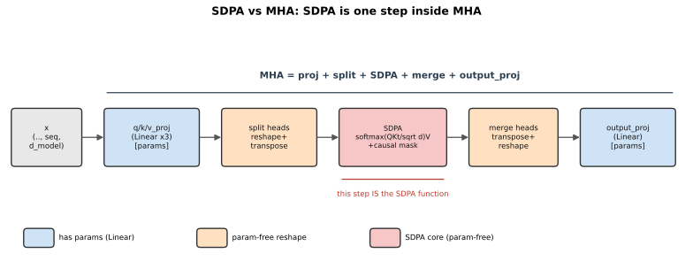
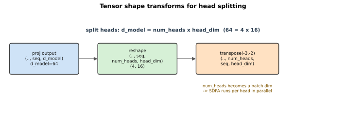
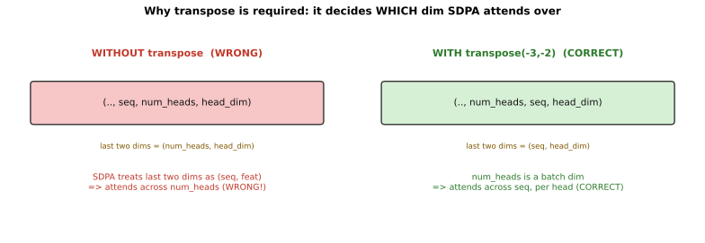

# 实现多头自注意力（Multi-Head Self-Attention）：原理、拆头与验证

## 0. 本文目标

记录 CS336 assignment1 里 **多头自注意力（MHA）** 的实现思路：为什么要"多头"、QKV 如何用单次大矩阵投影再拆头、因果掩码怎么加、adapter 怎么接到测试。这是 Transformer block 的两大子层之一（另一个是 SwiGLU FFN）。

对应实际代码：
- 实现：[cs336_basics/model.py](../cs336_basics/model.py) 的 `MultiHeadSelfAttention`
- 接线：[tests/adapters.py](../tests/adapters.py) 的 `run_multihead_self_attention`
- 测试：[tests/test_model.py](../tests/test_model.py) 的 `test_multihead_self_attention`

依赖前置：[SDPA 笔记](./02_11_attention_implementation_notes.md)（核心打分）、[Linear 笔记](./02_02_linear_implementation_notes.md)（四个投影）、[softmax 笔记](./02_10_softmax_implementation_notes.md)。

---

## 1. 背景：为什么要"多头"

单个注意力（[SDPA](./02_11_attention_implementation_notes.md)）只能学到一种"关注模式"。**多头**的想法是：把 `d_model` 维切成 `num_heads` 份，每份 `head_dim = d_model / num_heads`，**每个头在自己的低维子空间里独立做一次注意力**，最后把各头结果拼起来再投影。

好处：不同头可以学到不同关系——有的头关注相邻词、有的关注句法主谓、有的关注远距离指代。多头让模型在**同一层里并行捕捉多种依赖**，且总计算量与单头相当（维度被切分了）。

**自注意力（self-attention）** 指 Q、K、V 都来自同一个输入 $x$（区别于 cross-attention 的 Q 来自解码端、K/V 来自编码端）。

下图直观展示 **SDPA 与 MHA 的关系**——SDPA 只是 MHA 中间的一步，MHA 在它两侧还包了投影、拆头、合头、输出投影：



蓝色框是带可学习参数的 `Linear`，橙色是无参数的形状变换，红色是 SDPA 核心（无参数纯计算）。这也解释了为什么 MHA 写成类、SDPA 写成函数。

### 1.1 完整公式一览

把上图各步写成公式。设输入 $X \in \mathbb{R}^{\text{seq}\times d_{model}}$（每行一个 token），头数 $h$，每头维度 $d_k = d_{model}/h$。

第一步，QKV 投影（用大矩阵一次算，再拆成 $h$ 个头）：

$$ Q = X W_Q^\top,\quad K = X W_K^\top,\quad V = X W_V^\top $$

第二步，每个头 $i$ 独立做带因果掩码的缩放点积注意力（$Q_i,K_i,V_i$ 是第 $i$ 个头的切片）：

$$ \text{head}_i = \mathrm{softmax}\!\left(\frac{Q_i K_i^\top}{\sqrt{d_k}} + M\right) V_i $$

其中 $M$ 是因果掩码矩阵：允许处为 $0$、屏蔽处为 $-\infty$（加进 softmax 前的分数里，等价于代码的 `masked_fill`）。

第三步，拼接各头再过输出投影：

$$ \mathrm{MHA}(X) = \mathrm{Concat}(\text{head}_1,\dots,\text{head}_h)\, W_O^\top $$

四个权重 $W_Q, W_K, W_V, W_O \in \mathbb{R}^{d_{model}\times d_{model}}$ 就是代码里的 `q_proj`、`k_proj`、`v_proj`、`output_proj`。

> 记号（仓库规则 R1/R2）：上式按 PyTorch 的行主序布局写——token 在行、特征在最后一维，故投影是 $X W^\top$。若按纯数学的列向量约定，对单个 token $x$ 则记 $q = W_Q\,x$、$k = W_K\,x$、$v = W_V\,x$，最终 $\mathrm{MHA}(x) = W_O\,\mathrm{Concat}(\dots)$；两者是同一运算的两种写法。

---

## 2. 逐个决定的理由

### 2.1 接口与契约

来自 `run_multihead_self_attention` / 测试：

- 输入 `in_features (..., seq, d_model)`；
- 四个投影权重各 `(d_model, d_model)`：`q/k/v_proj` 和 `output_proj`；
- `head_dim = d_model // num_heads`；
- 输出 `(..., seq, d_model)`，形状不变。
- 测试用 `layers.0.attn.{q,k,v,output}_proj.weight` 作参考权重、`in_embeddings` 作输入，比对快照（`atol=1e-5`）。

因为是 **self-attention** 且用于**因果语言模型**，实现里加了**因果掩码**（每个位置只能看自己和之前）。

### 2.2 四个投影用子 `Linear`

`__init__` 里建 `q_proj/k_proj/v_proj/output_proj` 四个 `Linear(d_model, d_model)`。理由同 [SwiGLU](./02_06_swiglu_implementation_notes.md)：复用已验证的无 bias `Linear`、参数自动登记、`state_dict` 键为 `q_proj.weight` 等与官方命名一致，adapter 用 `load_state_dict` 直接装参考权重。

> 呼应 [nn_module 笔记 2.4 的原则](./02_01_nn_module_and_linear_explained.md)：MHA 有可学习参数（四个投影），所以写成 `nn.Module` 类；而它内部调用的 SDPA/softmax 是无状态纯函数。

### 2.3 "单次大矩阵投影 + 拆头"

契约要求"用一个矩阵乘完成所有头的 QKV 投影"。做法是：

```python
Q, K, V = self.q_proj(x), self.k_proj(x), self.v_proj(x)   # 各 (..., seq, d_model)
# 拆头：(..., seq, d_model) -> (..., num_heads, seq, head_dim)
def split_heads(t):
    return t.reshape(*batch, seq, num_heads, head_dim).transpose(-3, -2)
```

- **一次投影**：`q_proj(x)` 对全 `d_model` 一次算完，等价于所有头的 Q 拼在一起，比逐头小矩阵乘高效；
- **reshape 拆头**：把最后的 `d_model` 维拆成 `(num_heads, head_dim)`；
- **transpose(-3,-2)**：把 `num_heads` 提到 `seq` 前面，得 `(..., num_heads, seq, head_dim)`。这样 `num_heads` 变成"批量维"，SDPA 的 `...` 会自动对每个头并行处理（正是 [SDPA 笔记](./02_11_attention_implementation_notes.md) 里 4D 场景验证过的）。

下图展示这两步的张量形状变换：



> **transpose 是必须的吗？不 transpose 行不行？** 必须——不 transpose 会**算错**，不只是慢。原因在于 SDPA 把**最后两维**当 `(序列, 特征)`、其余当批量维，并在序列维之间做注意力。
>
> - **不 transpose**：张量是 `(.., seq, num_heads, head_dim)`，最后两维是 `(num_heads, head_dim)`，SDPA 会误在 **num_heads 之间**做注意力——完全错位；
> - **transpose 后**：`(.., num_heads, seq, head_dim)`，最后两维是 `(seq, head_dim)`，num_heads 退成批量维，SDPA 才会正确地"每个头内、在 seq 之间"做注意力。
>
> 
>
> 所以 transpose 不是性能优化，而是**决定注意力发生在哪个维度**。想不 transpose 也行，但要换等价写法（如用 `einsum` 显式指定维度，或把 head 并进 batch）——本质都是"让 SDPA 在正确的维度上操作"，当前 `reshape+transpose` 是最清晰的标准写法。

> **为什么调用 `scaled_dot_product_attention(Q, K, V, mask)` 时不用告诉它"这是多头"？** 因为 SDPA 的接口就是"**只认最后两维 `(seq, feat)`，其余一律当批量维**"（见 [SDPA 笔记](./02_11_attention_implementation_notes.md) 的 `...` 写法）。它对批量维里究竟是 batch、还是 head、还是 batch×head 完全**无感知、也不关心**——每个批量位置各算各的，互不影响。
>
> 正因如此，MHA 只需在调用**之前**用 transpose 把 `num_heads` 挪进批量维（变成 `(.., num_heads, seq, head_dim)`），SDPA 就会**自动对每个头独立并行**做注意力，无需任何"多头"参数或分支逻辑。这是一种干净的**关注点分离**：
>
> - **SDPA 只负责**："给定一批 `(seq, feat)`，各自算注意力"——单一职责，不知道多头的存在；
> - **MHA 负责**：投影、把头塞进批量维、算完再取出来合并。
>
> 好处：同一个 SDPA 函数既能被 3D（无多头）调用，也能被 4D（多头）调用（正是 `test_scaled_dot_product_attention` 与 `test_4d_...` 两个测试验证的）；将来加 batch 维、GQA 分组等也不用改 SDPA。**"多头"这件事完全由 MHA 在外面用形状变换承担，SDPA 无需感知。**

### 2.4 因果掩码

```python
mask = torch.tril(torch.ones(seq, seq, dtype=torch.bool, device=x.device))
```

`tril` 取下三角为 `True`：位置 $i$ 只能看 $j \le i$。传给 SDPA 后，上三角（未来位置）被置 $-\infty$、softmax 归 0——这就是自回归语言模型"不能看未来"的实现。mask 形状 `(seq, seq)` 会广播到所有 batch 和 head。

### 2.5 合头与输出投影

```python
out = out.transpose(-3, -2).reshape(*batch, seq, d_model)   # 合头
return self.output_proj(out)                                # 融合各头信息
```

- **transpose 回来 + reshape**：把 `(..., num_heads, seq, head_dim)` 变回 `(..., seq, d_model)`，即把各头结果在特征维拼接；
- **output_proj**：最后一个 `Linear`，把拼接结果混合，让各头信息交互。这一步不可省——否则各头是孤立的。

> **output_proj 是什么？（之前没细讲，这里补上）** 它是 MHA 的**第四个投影**，即原论文里的输出投影 $W_O$（前三个是 `q/k/v_proj`）。原论文的多头注意力写作：
>
> $$ \mathrm{MultiHead}(x) = \mathrm{Concat}(\text{head}_1, \dots, \text{head}_h)\, W_O $$
>
> 各头独立算完注意力、在特征维拼接回 `d_model` 后，$W_O$ 再做一次线性变换。
>
> **为什么不可省**：拼接只是把各头输出"摞在一起"，头与头之间还没有任何交互。$W_O$ 让不同头的输出**线性混合**，模型才能综合利用"这个头看语法、那个头看指代"的信息。没有它，各头就是彼此孤立的并行分支，白白浪费了多头的价值。它也是 [SDPA vs MHA 图](./images/mha_pipeline.svg) 里最右边那个蓝色（带参数）框。

> **合头处为什么非要 reshape？** 因为这一步的 reshape **就是"拼接各头"这个操作本身**，不是可有可无的整形。两个层面：
>
> 1. **输出必须回到 `d_model`**：MHA 是 `d_model → d_model` 子层，它的输出要立刻交给 `output_proj`（`Linear(d_model, d_model)`，只认 `d_model`）、残差 `x + MHA(x)`、以及下一层（RMSNorm/FFN，都在 `d_model` 空间）。"多头"是我们人为把 `d_model` 切成 `num_heads × head_dim` 的，算完必须还原回去。
> 2. **reshape 恰好等于 concat**：把最后两维 `(num_heads, head_dim)` 合成一维，数学上正是"沿特征轴拼接各头"：
>
> ```text
> head_0=[a0 a1 a2 a3]  head_1=[b0 b1 b2 b3]  head_2=[c..]  head_3=[d..]
>          ↓ reshape 合并最后两维
> [a0 a1 a2 a3 | b0 b1 b2 b3 | c0.. | d0..]   # d_model = 4×4 = 16
> ```
>
> 这正是原论文 $\mathrm{Concat}(\text{head}_1,\dots,\text{head}_h)$ 落到张量上的写法——也是为什么要先 `transpose` 把 `seq` 换到 `num_heads` 前：只有排成 `(.., seq, num_heads, head_dim)`，合并最后两维才是"每个位置内、把它自己的各头拼起来"，位置不会串。
>
> **能不能不 reshape？** 能，但都只是换写法、本质同一件事：`einops.rearrange('.. h s d -> .. s (h d)')` 底层就是 transpose+reshape；或用恒等式 $\mathrm{Concat}(\text{heads})W_O=\sum_h \text{head}_h W_O^{(h)}$ 把 $W_O$ 按头分块、逐头乘再求和，从而免去显式拼接——但更繁琐，还丢了"一次大矩阵乘"的效率。标准实现选 reshape + 单个大 matmul，最直接也最高效。

### 2.6 是否手写 backward

不需要。全部由 `Linear`、`reshape`、`transpose`、SDPA（含 softmax）组成，都是可微算子，autograd 自动求导。

### 2.7 这些 reshape / transpose 是重操作吗？

结论先行：**它们是轻操作，不是 MHA 的开销瓶颈。** 真正贵的是矩阵乘（投影和 SDPA 里的 $QK^\top$、$\cdot V$）。但有一个细节值得知道——transpose 本身零成本，可它会让紧跟的 reshape "被迫"拷贝一次内存。

**为什么 reshape / transpose 通常很便宜**

PyTorch 张量 = 一块连续内存 + 一组"元数据"（shape、stride）。很多形状操作只改元数据、**不动底层数据**：

- **`transpose(-3,-2)`**：只是交换两个维度的 stride，底层数据一个字节都不搬，$O(1)$，返回一个和原张量**共享内存**的视图（view）；
- **`reshape`**：若张量内存连续，也只改元数据、$O(1)$ 返回视图。

相比之下，投影的矩阵乘是 $O(\text{seq}\cdot d_{model}^2)$、SDPA 的打分是 $O(\text{seq}^2\cdot d)$——**计算量高好几个数量级**。所以形状操作在整体耗时里几乎可以忽略。

**一个例外：transpose 之后的 reshape 会触发拷贝**

关键点在这里。`transpose` 返回的视图是**非连续（non-contiguous）**的——它的数据在内存里不再按新维度顺序排列。此时若要 `reshape` 成一个跨越了被转置维度的新形状，PyTorch **无法只改元数据**，必须真正**拷贝一次数据**让它重新连续。

对照 MHA 的两处：

- **拆头**：`reshape(.., seq, num_heads, head_dim)` 在 `transpose` **之前**做，此时张量还连续 → reshape 是零拷贝视图；随后的 `transpose` 也是 $O(1)$；
- **合头**：`out.transpose(-3,-2).reshape(.., seq, d_model)` 里，reshape 紧跟在 transpose **之后**，作用在非连续视图上 → 这一步会**隐式触发一次 $O(\text{seq}\cdot d_{model})$ 的内存拷贝**（等价于内部先 `.contiguous()`）。

**这次拷贝要紧吗？** 不要紧。它只是把 `(.., num_heads, seq, head_dim)` 的数据搬成连续布局，成本与元素总数成正比（线性），仍**远小于**同一前向里的矩阵乘（平方/更高次）。所以它不改变"矩阵乘才是瓶颈"的结论，只是解释了"为什么合头那步比拆头那步多一点点开销"。

**小结**：reshape/transpose 本质是改元数据的轻操作；唯一的实际数据搬运发生在"transpose 后接 reshape"（合头处）的隐式拷贝，且是线性成本，相对矩阵乘可忽略。真要抠性能，优化点在矩阵乘与注意力（如 FlashAttention），而不是这些形状变换。

---

## 3. adapter 怎么接到测试

`run_multihead_self_attention` 三步：

1. 构造 `MultiHeadSelfAttention(d_model, num_heads, ...)`；
2. `load_state_dict` 装入四个投影权重（键 `q_proj.weight`/`k_proj.weight`/`v_proj.weight`/`output_proj.weight`）；
3. 返回 `mha(in_features)`。

---

## 4. 为什么测试能过

投影、拆头、因果 SDPA、合头、输出投影都与参考一致，权重来自外部。链路：

```text
test_mha → run_multihead_self_attention（装 4 个投影权重）
        → MHA.forward: 投影 → 拆头 → 因果 SDPA → 合头 → output_proj
        → numpy_snapshot 对照 _snapshots → PASS
```

运行：

```sh
uv run pytest -k "test_multihead_self_attention and not rope"
```

预期 `1 passed`。

> 为什么加 `and not rope`：`-k` 是**子串匹配**，直接写 `-k test_multihead_self_attention` 会同时选中 `test_multihead_self_attention_with_rope`（下一个、尚未实现的 test），导致出现一个 `NotImplementedError` 的 FAILED。加 `and not rope` 排除它，只跑本测试。

---

## 5. 小结

1. **多头**：把 `d_model` 切成 `num_heads × head_dim`，每头独立注意力，捕捉多种依赖，总算量不变。
2. **单次投影 + 拆头**：`Linear` 一次算完，再 `reshape` + `transpose(-3,-2)` 把 `num_heads` 变批量维，让 SDPA 逐头并行。
3. **因果掩码**：`tril` 下三角 True，位置只能看自己和之前，实现自回归。
4. **合头 + 输出投影**：`transpose` 回来 `reshape` 拼接，再 `output_proj` 融合各头。
5. **复用 + 自动 backward**：四个子 `Linear` + SDPA/softmax 纯函数；有参数故用类，全可微。

---

## 参考

- 本仓库实现：[cs336_basics/model.py](../cs336_basics/model.py)
- 适配层：[tests/adapters.py](../tests/adapters.py)
- 测试：[tests/test_model.py](../tests/test_model.py)
- 依赖：[02_11_attention_implementation_notes.md](./02_11_attention_implementation_notes.md)（SDPA）、[02_02_linear_implementation_notes.md](./02_02_linear_implementation_notes.md)、[02_10_softmax_implementation_notes.md](./02_10_softmax_implementation_notes.md)
- 设计原则：[02_01_nn_module_and_linear_explained.md](./02_01_nn_module_and_linear_explained.md)（何时用类）
- 原始文献：Vaswani et al., *Attention Is All You Need*, 2017（§3.2.2 Multi-Head Attention）。
