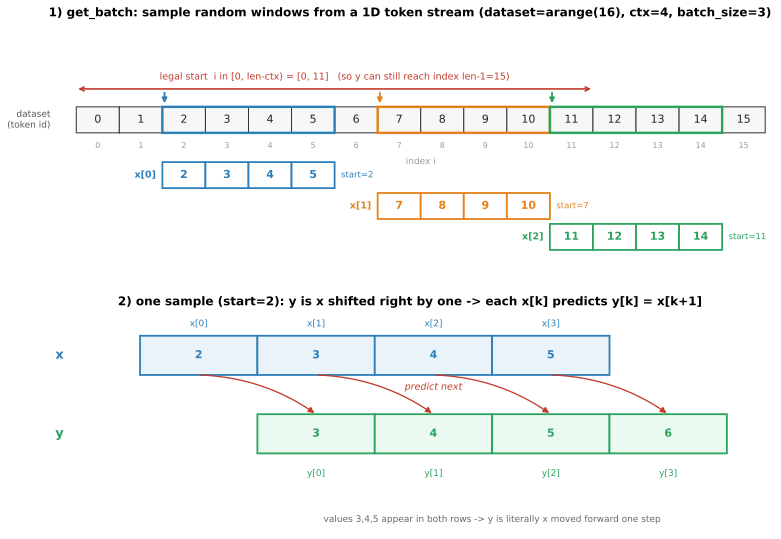

# 实现数据批采样（get_batch）：原理与验证

## 0. 本文目标

记录 CS336 assignment1 里**数据加载** `get_batch` 的实现：语言模型训练怎么从一长串 token 里采出 `(输入, 标签)` 批、为什么标签是输入右移一位、起点怎么随机采、adapter 怎么接到测试。

对应实际代码：
- 实现：[cs336_basics/data.py](../cs336_basics/data.py) 的 `get_batch`
- 接线：[tests/adapters.py](../tests/adapters.py) 的 `run_get_batch`
- 测试：[tests/test_data.py](../tests/test_data.py) 的 `test_get_batch`

前置：[交叉熵笔记](./03_01_cross_entropy_implementation_notes.md)（$D$/batch/seq 维度、下一 token 预测）。

---

## 1. 背景：语言模型的数据长什么样

BPE tokenizer 把整个语料编码成**一长串 token id**（一维数组，可能上亿个）。训练时不可能一次喂全部，而是每步随机截取若干段定长片段组成一个 batch。`get_batch` 就干这件事：**从 1D token 数组里随机采 `batch_size` 段、每段长 `context_length`，并配好"下一个 token"标签。**

**为什么标签是输入右移一位**：语言模型是**自回归**的，每个位置要预测**下一个** token（见 [交叉熵笔记](./03_01_cross_entropy_implementation_notes.md)）。所以：

```text
dataset:  ... [t_i, t_{i+1}, t_{i+2}, ..., t_{i+ctx-1}, t_{i+ctx}] ...
x (输入):      t_i, t_{i+1}, ..., t_{i+ctx-1}        # 从 i 开始，长 ctx
y (标签):      t_{i+1}, t_{i+2}, ..., t_{i+ctx}      # 从 i+1 开始，长 ctx
```

`x[k]` 的预测目标就是 `y[k] = x[k+1]`——一次前向，每个位置都在学"看到前文、预测下一个"。

---

## 2. 逐个决定的理由

### 2.0 一个具体的小例子（配图）

先用一个能一眼看懂的小例子把整件事跑通一遍。取 `dataset = arange(16)`（即 `[0,1,2,...,15]`，这里 token id 恰好等于下标，方便对照），`context_length=4`、`batch_size=3`，假设随机采到的三个起点是 `starts=[2, 7, 11]`：



**上半部分**——从一维 token 流里采窗口：

- 每个起点 `i` 往右切一段长 `ctx=4` 的片段作为一条 `x`。三条窗口用蓝/橙/绿标出，堆成一个 `(batch=3, ctx=4)` 的批。
- 红色双箭头是**合法起点范围** $[0, \text{len}-\text{ctx}) = [0, 11]$。为什么上界只能到 11？因为标签 `y` 要右移一位、取到窗口末端的**下一个** token；起点 11 时 `x` 覆盖下标 11..14，`y` 要取到 15（正好是最后一个 `len-1=15`），再往右就越界了。图里绿色窗口 `start=11` 就是踩在这个边界上的极限情形。

**下半部分**——`y` 就是 `x` 右移一位（以 `start=2` 那条为例）：

$$x = [\,2,\ 3,\ 4,\ 5\,], \qquad y = [\,3,\ 4,\ 5,\ 6\,]$$

- `x[0]=2` 的预测目标是 `y[0]=3`，`x[1]=3` 的目标是 `y[1]=4`……即每个位置都在学"**看到当前 token，预测下一个**"（红色弧线）。
- 注意 `3,4,5` 在 `x` 和 `y` 里都出现了——这正说明 `y` 不是另外取的数据，而**就是 `x` 这段整体向前挪一格**：`y[k] = x[k+1] = dataset[i+1+k]`。

一句话对照代码：上半部分是 `starts = np.random.randint(0, len-ctx, size=batch)` 加切片 `dataset[i:i+ctx]`；下半部分是 `dataset[i+1:i+1+ctx]` 的右移。

### 2.1 接口与契约

- `get_batch(dataset, batch_size, context_length, device)`：`dataset` 是 1D 整型 numpy 数组；
- 返回两个 `(batch_size, context_length)` 的 **LongTensor**（token id 是整数）放在 `device` 上；
- `y` 是 `x` 右移一位。

### 2.2 起点怎么随机采

```python
max_start = len(dataset) - context_length
starts = np.random.randint(0, max_start, size=batch_size)
```

- **合法起点范围 $[0, \text{len}-\text{ctx})$**：因为 `y` 要取到 `i+ctx`（右移一位的最后一个），起点最大只能到 `len-ctx-1`，否则越界。`np.random.randint(0, max_start)` 上界不含 `max_start`，正好是 $[0, \text{len}-\text{ctx}-1]$；
- **有放回随机**：每步独立均匀采样，不同 batch/step 可重叠——大语料下这是标准做法，比"顺序切分不重叠"更简单且覆盖充分。测试用统计检验（每个起点出现次数落在 $\mu\pm5\sigma$）验证采样确实均匀随机。

### 2.3 切片与转张量

```python
x = np.stack([dataset[i : i + context_length] for i in starts])
y = np.stack([dataset[i + 1 : i + 1 + context_length] for i in starts])
x = torch.tensor(x, dtype=torch.long, device=device)
y = torch.tensor(y, dtype=torch.long, device=device)
```

- 每个起点切一段 `x` 和右移一位的 `y`，`np.stack` 堆成 `(batch, ctx)`；
- **`dtype=torch.long`**：token id 是整数索引，要用长整型（后续进 Embedding 查表、进交叉熵当类别索引都要求 long）；
- **`device=device`**：直接建在目标设备上。测试用 `device="cuda:99"` 验证——非法设备号会让 `torch.tensor(..., device=...)` 抛 `RuntimeError`，说明 device 参数确实被传递/生效。

### 2.4 关于 memmap（背景）

真实语料（如 TinyStories 编码后）可能几 GB，装不进内存。工程上常把 token 存成磁盘文件、用 `np.memmap` **按需映射**读取——`get_batch` 的切片会只从磁盘读到用到的那几段，不必全量载入内存。本函数的逻辑对普通 array 和 memmap 完全一样（都支持切片索引），所以实现不用改；测试用小的 `np.arange(100)` 即可。

### 2.5 采样窗口可以跨越文档边界（`<|endoftext|>`）

**先说结论**：一条采样出来的 `x` **可以横跨 `<|endoftext|>`**——前半段是上一篇文档的结尾、中间是 `<|endoftext|>`、后半段是下一篇文档的开头。而且在"拼接 + 随机采"这种做法下，跨界不仅**被允许**，还**几乎必然**发生。

**为什么会跨界**：语料本是**一篇篇独立文档**（TinyStories 是一个个小故事，OWT 是一篇篇网页）。编码时的标准做法是用 `<|endoftext|>` 把它们首尾相接、拼成**一条极长的一维 token 流**（就是 `get_batch` 的 `dataset`）：

```text
[doc A 的 token] <|endoftext|> [doc B 的 token] <|endoftext|> [doc C ...] ...
```

`get_batch` 只在这条长流上按**随机起点**截**定长**窗口，**根本不知道文档边界在哪**。起点随机、窗口定长、边界不对齐，所以窗口盖住某个 `<|endoftext|>` 是常态。

**为什么这样没问题（甚至是想要的）**：

- **`<|endoftext|>` 只是词表里的一个普通 token**：它有自己的 id，模型照常对它做注意力、预测它、以它为条件。它是个**信号**，不会在计算上"清空状态、强制隔断"。
- **我们正是要让模型学会这个信号**：跨界窗口提供了两类关键监督——(1) 上一篇最后一个词的标签是 `<|endoftext|>`，教模型"**这里该结束**"；(2) `<|endoftext|>` 的标签是下一篇的第一个 token，教模型"**结束符之后，另起一篇与前文无关的新文档**"。推理时 `<|endoftext|>` 正是用作"起始新文档"的条件和停止符，这个能力必须在训练里见过。
- **因果掩码让"越界"影响可控**：Transformer 是因果的，位置 $t$ 只能看到 $\le t$ 的 token。跨界时下一篇的 token 在注意力里**确实还能 attend 到上一篇**，引入一点"跨文档注意力"噪声；但语料极大、跨界窗口占比不高，加上 `<|endoftext|>` 这个强信号让模型学会"边界之后基本可无视之前"，实践中影响很小。GPT-2/GPT-3、nanoGPT 等主流实现都这么做。

**代价 vs. 更严格的替代**：

- **本做法（拼接 + 随机采）**：实现极简、**无 padding、token 利用率 100%**，batch 里天然混着不同文档的片段（相当于额外打乱）；代价是上面那点跨文档注意力噪声。
- **document masking / 分块对角掩码**：额外记录每个 token 属于哪篇文档，构造掩码让注意力**不跨** `<|endoftext|>`，更干净但更复杂。CS336 assignment1 用的是最简单的拼接版，所以**序列可以跨界**。

一句话：**因为整个语料被拼成连续 token 流、`get_batch` 按随机起点盲切窗口**，跨越 `<|endoftext|>` 既不可避免也无害——用少量跨文档注意力噪声，换来实现简单和 100% 的数据利用率。

---

## 3. adapter 与测试

`run_get_batch` 转发到 `get_batch`。`test_get_batch` 做三件事：

1. **形状**：`x`、`y` 都是 `(batch_size, context_length)`；
2. **标签右移**：断言 `x + 1 == y`（因为测试数据是 `arange`，下一个 token 恰好是当前 +1）；
3. **随机性 + 边界**：跑 1000 次，统计每个起点出现次数落在 $\mu\pm5\sigma$（验证均匀随机），且起点范围恰好 $[0, \text{len}-\text{ctx}-1]$（不越界）；
4. **device**：`cuda:99` 应抛错。

运行：

```sh
uv run pytest -k test_get_batch
```

预期 `1 passed`。

---

## 4. 小结

1. **做什么**：从 1D token 数组随机采 `batch_size` 段长 `ctx` 的片段，配右移一位的标签。
2. **标签右移**：自回归 LM 每位置预测下一个 token，故 `y = x` 右移一位。
3. **起点范围**：$[0, \text{len}-\text{ctx})$，保证 `y` 不越界；有放回均匀采样。
4. **long + device**：token id 用 `torch.long`，张量直接建在目标 `device`（非法设备会抛错）。
5. **memmap 友好**：切片逻辑对内存数组和磁盘 memmap 通用，支持超大语料。

---

## 参考

- 本仓库实现：[cs336_basics/data.py](../cs336_basics/data.py)
- 适配层：[tests/adapters.py](../tests/adapters.py)
- 测试：[tests/test_data.py](../tests/test_data.py)
- 前置：[03_01_cross_entropy_implementation_notes.md](./03_01_cross_entropy_implementation_notes.md)（下一 token 预测、batch/seq 维度）
