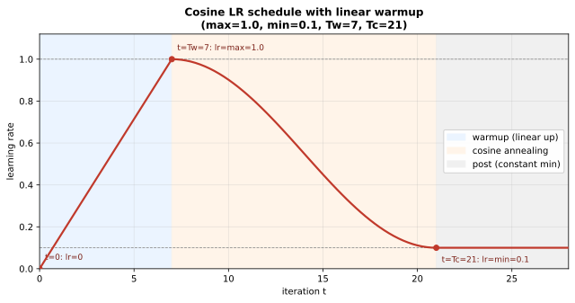

# 实现余弦学习率调度（Cosine Schedule with Warmup）：原理与验证

## 0. 本文目标

记录 CS336 assignment1 里**学习率调度** `get_lr_cosine_schedule` 的实现：为什么训练要动态调整学习率、warmup + 余弦退火三段公式各是什么、adapter 怎么接到测试。

对应实际代码：
- 实现：[cs336_basics/nn.py](../cs336_basics/nn.py) 的 `get_lr_cosine_schedule`
- 接线：[tests/adapters.py](../tests/adapters.py) 的 `run_get_lr_cosine_schedule`
- 测试：[tests/test_optimizer.py](../tests/test_optimizer.py) 的 `test_get_lr_cosine_schedule`

前置：[学习率调参笔记](./learning_rate_tuning_notes.md)（lr 过大发散、过小慢）、[优化器 API 笔记](./pytorch_optimizer_api_notes.md#L146)（lr 随 step 变化）。

---

## 1. 背景：为什么学习率要随训练变化

固定学习率有两难（见 [lr 笔记](./learning_rate_tuning_notes.md)）：训练**初期**参数远离最优、梯度大且噪声大，大 lr 易发散；训练**后期**接近谷底，大 lr 会在最优点附近来回震荡、难收敛。理想做法是**先小、再大、后小**：

- **Warmup（预热）**：开头用很小的 lr 线性升到峰值，避开初期不稳定（此时激活/梯度分布还没稳定，直接大 lr 常炸）；
- **Annealing（退火）**：达到峰值后平滑地降到一个很小的值，让后期精细收敛。

**余弦退火**是 LLaMA 等采用的主流方案——用余弦曲线从峰值平滑降到底值，比线性/阶梯衰减更平缓。

---

## 2. 三段式公式（handout §4.4）

给定当前步 $t$、峰值 $\alpha_{\max}$、底值 $\alpha_{\min}$、warmup 步数 $T_w$、余弦周期末步 $T_c$：

**① Warmup（$t < T_w$）**：线性升

$$ \alpha_t = \frac{t}{T_w}\,\alpha_{\max} $$

**② 余弦退火（$T_w \le t \le T_c$）**：

$$ \alpha_t = \alpha_{\min} + \frac{1}{2}\left(1+\cos\!\Big(\frac{t-T_w}{T_c-T_w}\pi\Big)\right)(\alpha_{\max}-\alpha_{\min}) $$

**③ 退火后（$t > T_c$）**：保持底值

$$ \alpha_t = \alpha_{\min} $$

**三个边界值验证**（对应测试）：$t{=}0\Rightarrow0$；$t{=}T_w\Rightarrow\alpha_{\max}$（$\cos0=1$，系数 1）；$t{=}T_c\Rightarrow\alpha_{\min}$（$\cos\pi=-1$，系数 0）。余弦项 $\frac12(1+\cos(\cdot))$ 从 1 平滑降到 0，正是"峰值→底值"的形状。

下图用测试的参数（$\alpha_{\max}{=}1,\alpha_{\min}{=}0.1,T_w{=}7,T_c{=}21$）画出完整曲线，三段一目了然：



蓝区线性升到峰值、橙区余弦平滑退火、灰区保持底值；三个红点正是上面验证的边界值。

---

## 3. 实现与 adapter

实现直译三段（完整见 [nn.py](../cs336_basics/nn.py)）：

```python
if it < warmup_iters:
    return it / warmup_iters * max_lr
if it <= cosine_cycle_iters:
    coeff = 0.5 * (1 + math.cos((it - warmup_iters) / (cosine_cycle_iters - warmup_iters) * math.pi))
    return min_lr + coeff * (max_lr - min_lr)
return min_lr
```

纯函数、无参数、无状态——它只是"给定步号 $t$ 返回该用的 lr"。训练循环里每步先用它算出 lr、写进 `optimizer.param_groups[i]["lr"]`，再 `opt.step()`（呼应 [优化器 API 笔记](./pytorch_optimizer_api_notes.md#L174) 里"lr 随 step 变化"）。

`run_get_lr_cosine_schedule` 直接转发。`test_get_lr_cosine_schedule` 用 $\alpha_{\max}{=}1,\alpha_{\min}{=}0.1,T_w{=}7,T_c{=}21$ 跑 $t=0..24$，逐点比对预期 lr 序列——先线性升到 1（第 7 步），再余弦降到 0.1（第 21 步），之后恒为 0.1。

运行：

```sh
uv run pytest -k test_get_lr_cosine_schedule
```

预期 `1 passed`。

---

## 4. 小结

1. **动机**：初期大 lr 易炸、后期大 lr 难收敛 → 先 warmup 升、再退火降。
2. **三段**：线性 warmup（$t<T_w$）→ 余弦退火（$T_w\le t\le T_c$）→ 恒定底值（$t>T_c$）。
3. **余弦项** $\frac12(1+\cos(\cdot))$ 从 1 平滑降到 0，边界：$T_w$ 处取 $\alpha_{\max}$、$T_c$ 处取 $\alpha_{\min}$。
4. **纯函数**：无参数无状态，每步算出 lr 后写进 `param_groups` 再 `step`。

---

## 参考

- 本仓库实现：[cs336_basics/nn.py](../cs336_basics/nn.py)
- 适配层：[tests/adapters.py](../tests/adapters.py)
- 测试：[tests/test_optimizer.py](../tests/test_optimizer.py)
- 前置：[learning_rate_tuning_notes.md](./learning_rate_tuning_notes.md)、[pytorch_optimizer_api_notes.md](./pytorch_optimizer_api_notes.md)
- Handout：[cs336_assignment1_basics_extracted.md](./cs336_assignment1_basics_extracted.md)（§4.4）；LLaMA (Touvron et al. 2023) 用余弦调度。
