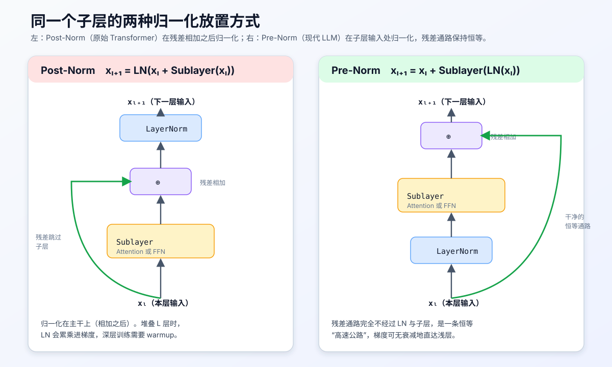
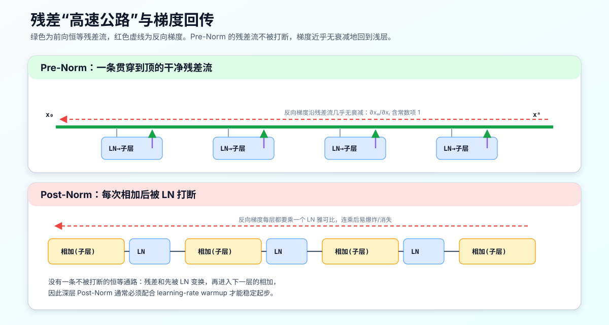
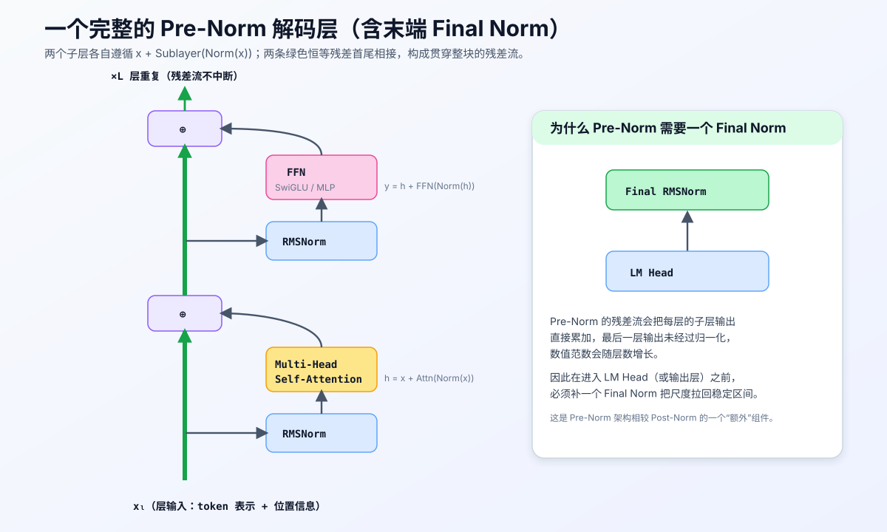

# Pre-Norm 与 Post-Norm：LLM 中归一化位置的原理、差异与工程取舍

## 0. 本文目标与阅读方式

这份讲义面向已经了解 Transformer 基本结构、但还没有系统想清楚"归一化到底该放在哪里"的读者。我们要回答三个层层递进的问题：

1. Post-Norm 与 Pre-Norm 在**公式与数据流**上到底差在哪一步；
2. 为什么这一步之差，会在**深层网络的可训练性**上造成巨大差异；
3. 为什么当代主流大模型（GPT 系列、LLaMA 系列、PaLM、GPT-NeoX 等）几乎一致地选择了 Pre-Norm，以及这个选择要付出的代价。

阅读顺序建议：先看第 1–3 节建立直觉与公式，再看第 4–6 节的梯度分析（这是"为什么流行"的核心），第 7 节之后是背景扩展与工程细节，可按需查阅。

本讲义与同目录下的 [byte_level_bpe_worked_example.md](./byte_level_bpe_worked_example.md) 属于同一套 CS336 学习笔记，符号风格保持一致。它讲的是"数据如何进入模型"，本文讲的是"数据进入模型后，每一层如何保持数值与梯度的稳定"。

> 说明：本文是概念讲解，不包含任何作业实现代码。文中出现的 `x + Sublayer(Norm(x))` 等是数学表达式，不是可直接粘贴的作业答案。

---

## 1. 先统一记号：一个 Transformer 层到底在做什么

一个标准的 Transformer 层由两个**子层（sublayer）**串联而成：

1. 自注意力子层（self-attention）；
2. 前馈子层（feed-forward network, FFN / MLP）。

每个子层外面都套着两个通用组件：

- **残差连接（residual / skip connection）**：把子层输入直接加到子层输出上；
- **归一化（normalization）**：LayerNorm 或 RMSNorm。

我们用如下记号：

- $x$：子层的输入向量（更严格地说是一个 $d$ 维隐藏表示，$d$ 为模型宽度 `d_model`）；
- $F(\cdot)$：子层本身的映射，即注意力或 FFN；
- $\mathrm{Norm}(\cdot)$：归一化算子（LayerNorm 或 RMSNorm）；
- $\oplus$：逐元素相加，也就是残差相加。

Pre-Norm 与 Post-Norm 的唯一区别，就是 $\mathrm{Norm}$ 这个算子插在数据流的哪个位置。**其余部分完全相同**。这一点非常重要：它们不是两种不同的模型，而是同一模型的两种"接线方式"。

---

## 2. 两种接线方式的定义

### 2.1 Post-Norm（原始 Transformer，2017）

Vaswani 等人在 *Attention Is All You Need* 中的原始写法是"**先残差相加，再归一化**"：

$$ x_{l+1} = \mathrm{Norm}\big(x_l \oplus F(x_l)\big) $$

也就是说，归一化算子位于**主干（trunk）**上，作用在"输入 + 子层输出"这个和之上。因为 $\mathrm{Norm}$ 排在残差相加的后面（post），所以叫 **Post-Norm**。

### 2.2 Pre-Norm（现代 LLM 主流，2019 起）

Pre-Norm 把归一化"**提前**"到子层输入处，只对进入子层的那份数据做归一化，而残差那一路保持原样：

$$ x_{l+1} = x_l \oplus F\big(\mathrm{Norm}(x_l)\big) $$

因为 $\mathrm{Norm}$ 排在子层前面（pre），所以叫 **Pre-Norm**。注意 $x_l$ 以**未经归一化**的原始形态被直接加到输出上——这正是它和 Post-Norm 的分水岭。

### 2.3 一张图看清区别

下图把两种接线方式并排画出。请重点观察**绿色的残差通路**：Post-Norm 的绿色通路最终要汇入一个 LayerNorm 才能到达下一层；而 Pre-Norm 的绿色通路是一条**完全不经过任何算子的恒等直线**。

一句话记忆：

- **Post-Norm**：`归一化(x + 子层(x))` —— 归一化在**外面/主干上**。
- **Pre-Norm**：`x + 子层(归一化(x))` —— 归一化在**里面/支路上**，主干是干净的。

---

## 3. 为什么"位置"如此关键：残差流的视角

要理解差异，最好的心智模型是把整个网络看成一条**残差流（residual stream）**——一条从输入一路贯穿到输出的"信息高速公路"，每一层只是往这条公路上**读取一份副本、加工、再把增量写回**。

### 3.1 Pre-Norm：一条不被打断的恒等高速公路

把 Pre-Norm 的递推式展开。设第 $l$ 层第一个子层记为 $F_l$，则：

$$ x_{l+1} = x_l + F_l(\mathrm{Norm}(x_l)) $$

把它从第 $0$ 层一路累加到第 $N$ 层，得到一个非常关键的**闭式展开**：

$$ x_N = x_0 + \sum_{l=0}^{N-1} F_l\big(\mathrm{Norm}(x_l)\big) $$

请仔细看这个式子的含义：最终表示 $x_N$ **等于原始输入 $x_0$，加上每一层贡献的一个增量之和**。原始输入 $x_0$ 以系数 $1$ 的形式**原封不动地保留到最顶层**。这就是"恒等高速公路"：残差流本身不做任何缩放、不经过任何非线性、不经过任何归一化。

### 3.2 Post-Norm：每一层都把公路"截断"一次

Post-Norm 无法写成这样干净的求和。因为每层都是：

$$ x_{l+1} = \mathrm{Norm}\big(x_l + F_l(x_l)\big) $$

外层的 $\mathrm{Norm}$ 会把"输入 + 增量"整体重新缩放、重新中心化。于是 $x_l$ 不再以系数 $1$ 直通到上层，而是**每经过一层就被 $\mathrm{Norm}$ 的雅可比矩阵乘一次**。信息高速公路在每一个出入口都被一道收费站（LayerNorm）拦下重新整形。

下图直观对比这两种"公路结构"，并标出反向梯度的走向：

这张图是理解"为什么 Pre-Norm 好训练"的钥匙，下一节我们把它落到梯度公式上。

---

## 4. 核心：梯度回传为什么天差地别

深层网络能不能训起来，本质取决于**梯度能否从顶层损失稳定地回传到底层参数**。梯度太小会消失、太大会爆炸，二者都会让训练发散或停滞。

### 4.1 Pre-Norm 的梯度：天然带一个常数项 1

对 Pre-Norm 的展开式 $x_N = x_0 + \sum_l F_l(\mathrm{Norm}(x_l))$ 求某一浅层 $x_l$ 对顶层 $x_N$ 的雅可比：

$$ \frac{\partial x_N}{\partial x_l} = I + \sum_{k\ge l} \frac{\partial F_k(\mathrm{Norm}(x_k))}{\partial x_l} $$

关键在于那个**单位矩阵 $I$**：无论中间那些子层的雅可比多小（甚至趋于 0），梯度里始终有一条系数为 $1$ 的恒等通路。于是回传到浅层的梯度不会被整体压没，也就**天然缓解了梯度消失**。这正是 3.1 节恒等高速公路在反向传播中的体现。

用链式法则表达损失 $\mathcal{L}$ 对浅层的梯度：

$$ \frac{\partial \mathcal{L}}{\partial x_l} = \frac{\partial \mathcal{L}}{\partial x_N}\Big(I + \sum_{k\ge l}\frac{\partial F_k(\mathrm{Norm}(x_k))}{\partial x_l}\Big) $$

括号里那个 $I$ 保证了 $\dfrac{\partial \mathcal{L}}{\partial x_N}$ 至少能**原样**传到浅层。

### 4.2 Post-Norm 的梯度：一串雅可比连乘

Post-Norm 每层都套了外层 $\mathrm{Norm}$，浅层梯度要穿过每一层的归一化雅可比 $J^{\mathrm{Norm}}_k$：

$$ \frac{\partial \mathcal{L}}{\partial x_l} = \frac{\partial \mathcal{L}}{\partial x_N}\prod_{k=l}^{N-1} J^{\mathrm{Norm}}_k \big(I + J^{F}_k\big) $$

这是一个**连乘**结构。连乘的麻烦在于：若每个因子的谱范数略小于 1，$N$ 层乘下来指数衰减（梯度消失）；略大于 1 则指数放大（梯度爆炸）。层数 $N$ 越大，越难恰好落在稳定区间。这就是为什么原始 Post-Norm Transformer 在层数加深时对**学习率与初始化极其敏感**。

### 4.3 直接后果：Pre-Norm 训练稳、可去 warmup、可加深

上述差异带来三个被反复验证的经验结论：

1. **对学习率更鲁棒**：Pre-Norm 能在更大的学习率、更宽的超参范围内稳定训练。
2. **可以弱化甚至去掉 warmup**：Post-Norm 深层模型几乎必须用 learning-rate warmup（前若干步把学习率从 0 缓慢拉起）才能不发散；Pre-Norm 对 warmup 的依赖显著降低。Xiong 等人 2020 年的 *On Layer Normalization in the Transformer Architecture* 从理论与实验两方面论证了这一点：Post-Norm 在初始化附近，靠近输出层的梯度期望范数会随深度增大，而 Pre-Norm 的梯度范数与深度基本无关。
3. **更容易加深**：正因为梯度不随深度爆炸/消失，Pre-Norm 能相对轻松地堆到几十上百层，这正是大模型 scaling 的前提。

> 一句话总结第 4 节：**Pre-Norm 把"恒等映射"焊死在了残差主干上，使得梯度天然带一个常数项 1；Post-Norm 则把归一化插在主干上，让梯度变成一串对深度敏感的连乘。** 这就是 Pre-Norm 在当下极其流行的根本原因。

---

## 5. 完整的一层：把两个子层拼起来

前面为了聚焦，只写了单个子层。真实的 Transformer 层是"注意力子层 + FFN 子层"串联，Pre-Norm 下每个子层都遵循 `x + Sublayer(Norm(x))`：

第一步（注意力子层）：

$$ h = x + \mathrm{Attention}\big(\mathrm{Norm}(x)\big) $$

第二步（前馈子层）：

$$ y = h + \mathrm{FFN}\big(\mathrm{Norm}(h)\big) $$

两条残差首尾相接，$x$ 到 $y$ 之间始终存在一条恒等通路。下图画出一层内部的完整接线，并顺带引出 Pre-Norm 特有的一个组件——末端的 Final Norm：

### 5.1 Pre-Norm 必须补一个"最终归一化"（Final Norm）

Pre-Norm 有一个容易被初学者忽略的细节：**残差主干上的数值范数会随层数累积增长**。因为每层都往主干上"加"东西，而主干本身从不被归一化，所以到最顶层时，$x_N$ 的尺度可能已经比 $x_0$ 大很多。

因此，几乎所有 Pre-Norm 大模型都会在**最后一层之后、送入输出层（LM Head）之前**，额外加一个归一化，通常称为 **final norm / ln_f**：

$$ z = \mathrm{Norm}(x_N) $$

再用 $z$ 去算 logits。这是 Pre-Norm 相对 Post-Norm 多出来的一个"收尾"组件。Post-Norm 因为主干时刻被归一化，反而不需要这个额外步骤。

---

## 6. LayerNorm 与 RMSNorm：归一化算子本身

无论 Pre 还是 Post，$\mathrm{Norm}$ 具体是什么算子也值得说清楚，因为现代 LLM 在这里也做了简化。

### 6.1 LayerNorm

对一个 $d$ 维向量 $x$，LayerNorm 先减均值、再除标准差，最后用可学习的缩放 $\gamma$ 与偏置 $\beta$ 调整：

均值与方差：

$$ \mu = \frac{1}{d}\sum_{i=1}^{d} x_i, \qquad \sigma^2 = \frac{1}{d}\sum_{i=1}^{d}(x_i-\mu)^2 $$

输出：

$$ \mathrm{LN}(x)_i = \gamma_i \cdot \frac{x_i-\mu}{\sqrt{\sigma^2+\epsilon}} + \beta_i $$

其中 $\epsilon$ 是防止除零的小常数。关键点：LayerNorm 在**特征维度**上归一化，与 batch 大小无关，因此天然适合变长序列与自回归生成——这也是 Transformer 不用 BatchNorm 的原因。

### 6.2 RMSNorm

RMSNorm（Root Mean Square Norm）是 LLaMA 等模型采用的简化版：**去掉均值中心化，只做均方根缩放**：

$$ \mathrm{RMSNorm}(x)_i = \gamma_i \cdot \frac{x_i}{\sqrt{\frac{1}{d}\sum_{j=1}^{d} x_j^2 + \epsilon}} $$

它省去了减均值和偏置 $\beta$，计算更省、参数更少，实践中效果与 LayerNorm 相当甚至更好。**Pre-Norm + RMSNorm** 已经成为当代开源 LLM 的近乎标准组合。

（说明：上式的增益 $\gamma_i$ 就是 RMSNorm 原论文里记的 $g_i$，很多实现里叫 `weight` 或 `gain`。下面沿用 $g_i$ 这个记号。）

### 6.3 增益 $g_i$ 是每个 norm 块各自独立的，不是全局共享

一个常见疑问：RMSNorm 里的可学习增益 $g_i$（即上面的 $\gamma_i$）是整个模型共用一份，还是每个归一化块都有自己的一份？

**答案：每个 RMSNorm 块都有它自己独立的 $g$，不是全局通用的。** 也就是说，一个 $L$ 层的 Pre-Norm Transformer，注意力前有一个 RMSNorm、FFN 前有一个 RMSNorm、末端还有一个 Final Norm（见 5.1 节），这些 norm **各自拥有一个长度为 $d$ 的独立参数向量 $g$**，总共约 $2L+1$ 个互不共享的 $g$。

**为什么必须各自独立，几个层面的原因：**

1. **每个 norm 的输入分布不同，需要各自的尺度。** RMSNorm 先把输入按均方根归一化到统一尺度，再用 $g$ 逐通道地"放大或缩小"回该子层真正需要的尺度。第 3 层注意力前的激活统计，和第 20 层 FFN 前的激活统计完全不同；用同一份 $g$ 去适配所有位置，等于强行假设全模型每个通道的理想缩放都一样，这几乎不可能成立。

2. **$g$ 的作用是"逐通道恢复表达力"，这天然是局部的。** 归一化会抹掉输入向量的整体幅度信息，$g$ 的职责就是把"哪些通道该更突出"这一信息重新学回来。不同深度、不同子层（attention vs FFN）关心的通道重要性不同，所以每块要学自己的一份。

3. **和其它逐层参数一致。** Transformer 里注意力和 FFN 的权重本来就是每层独立的，没有理由单独把 norm 的 $g$ 拎出来做全局共享；共享只会人为增加优化耦合、限制容量，却几乎不省参数（$g$ 只有 $d$ 维，占比极小）。

4. **代价极低，所以没必要共享。** 每个 $g$ 只有 $d$ 个参数（相比一个 FFN 动辄 $8d^2$ 量级的权重可忽略不计）。用这么小的成本换取每个 norm 独立的逐通道缩放，性价比极高。

**一个有用的对照**：$g$ 是**每个 norm 块独立**的可学习参数；而 RoPE 的旋转频率 $\theta_i$（见配套 [rope_explained.md](./rope_explained.md)）是**全模型共享且不可学习**的固定值。两者都作用在"逐通道/逐维度"层面，但可学习性与共享范围恰好相反，可对照记忆。

> 小结：$g_i$ 是**每个归一化块各自一份**、随该块局部学习的逐通道增益，不是全局通用参数。根本原因是不同子层、不同深度处的激活分布不同，需要各自的通道级缩放来恢复被归一化抹掉的表达力。

> 注意：Pre/Post 讨论的是 $\mathrm{Norm}$ 的**位置**，LayerNorm/RMSNorm 讨论的是 $\mathrm{Norm}$ 的**内部实现**。这是两个正交的设计维度，可以自由组合。

---

## 7. 背景扩展：为什么最初要用 Post-Norm，后来又转向 Pre-Norm

这一节补充历史脉络，帮助理解设计演化不是凭空发生的。

### 7.1 残差连接的思想来源

残差连接来自计算机视觉的 ResNet（He 等，2015）。它解决的核心问题正是"深层网络退化"：当网络很深时，理论上更深不应更差（大不了让多出来的层学成恒等映射），但实际中普通深层网络反而更难训练。ResNet 的答案是**显式提供恒等捷径**，让"学成恒等"变成默认行为而非需要费力学习的目标。Pre-Norm 把这一思想贯彻得更彻底——连归一化都不许挡在捷径上。

### 7.2 原始 Transformer 为何选 Post-Norm

2017 年的原始 Transformer 只有 6 层编码器 + 6 层解码器，深度不大，Post-Norm 配合 warmup 完全能训好。当时也没有强烈动机去挑战"相加后归一化"这个看起来更自然的顺序（毕竟"把每层输出规整到同一尺度再传下去"符合直觉）。问题是在人们想把模型堆到几十上百层、做大规模预训练时才尖锐暴露出来的。

### 7.3 转向 Pre-Norm 的关键节点

- **2019 年前后**：多篇工作（如 Child 等的 Sparse Transformer、Baevski & Auli 的语言模型工作，以及 GPT-2 的实现）开始采用 Pre-Norm，观察到深层训练更稳。
- **2020 年**：Xiong 等的 *On Layer Normalization in the Transformer Architecture* 给出理论解释，明确指出 Pre-Norm 的梯度范数与深度解耦、可去 warmup。
- **此后**：GPT-3、GPT-NeoX、PaLM、LLaMA 系列等大模型几乎一致采用 Pre-Norm（多数还搭配 RMSNorm）。Pre-Norm 由此成为事实标准。

---

## 8. Pre-Norm 的代价与已知缺点

流行不等于没有缺点。诚实地列出取舍，才是工程视角：

1. **最终表示能力/性能上限的争议**：有研究（如微软的 DeepNet 及相关工作）指出，在**充分调好 warmup 与初始化**的前提下，Post-Norm 有时能达到略高的最终质量，因为它对每层输出施加了更强的正则化约束。Pre-Norm 用"好训练"换取了一点点"表达受限"的风险——各层增量都只是往主干上做小扰动。
2. **深层的"表示坍塌"倾向**：Pre-Norm 越深，后面层能贡献的相对增量越小（因为主干范数越来越大，新增量占比越来越低），极深时部分层可能近似冗余。
3. **必须加 Final Norm**：如第 5.1 节所述，这是额外组件，遗漏会导致输出尺度失控。
4. **数值范围增长**：残差主干范数随层数上升，在低精度（fp16/bf16）训练中需要留意溢出与精度问题。

正因如此，出现了 **DeepNorm**（DeepNet，2022）这类折中方案：它本质是改良的 Post-Norm，通过给残差分支乘一个与深度相关的常数 $\alpha$ 并配套特定初始化，让 Post-Norm 也能稳定堆到上千层。其残差写法可概括为：

$$ x_{l+1} = \mathrm{Norm}(\alpha \cdot x_l + F(x_l)) $$

这说明"Pre vs Post"不是非黑即白，而是一条仍在演化的设计谱系。

---

## 9. 常见变体与相关设计一览

为了让知识网络更完整，这里横向列出与"归一化位置"相关或经常一起出现的设计：

| 名称 | 归一化位置/形式 | 典型代表 | 关键特点 |
|---|---|---|---|
| Post-Norm | `Norm(x + F(x))` | 原始 Transformer、BERT | 直觉自然，深层需 warmup |
| Pre-Norm | `x + F(Norm(x))` | GPT-2/3、LLaMA、PaLM | 恒等残差流，好训练，需 Final Norm |
| DeepNorm | 改良 Post-Norm + 深度缩放 | DeepNet | Post-Norm 也能稳定堆到极深 |
| Sandwich-Norm | 子层前后各一个 Norm | 部分大模型 | 试图兼顾稳定与表达 |
| RMSNorm | 去均值的归一化实现 | LLaMA 系列 | 更省算力，常与 Pre-Norm 搭配 |

此外还有两个常被一起讨论、但**与 Pre/Post 正交**的点：

- **残差缩放 / LayerScale**：给每个子层输出乘一个可学习的小初值向量，进一步稳定深层训练。
- **QK-Norm**：对注意力里的 query/key 做归一化，是另一处独立的稳定化技巧。

---

## 10. 小结：一页纸记住 Pre-Norm

如果只带走几句话：

1. **唯一区别是 $\mathrm{Norm}$ 的位置**：Post-Norm 是 `Norm(x + F(x))`，Pre-Norm 是 `x + F(Norm(x))`。
2. **Pre-Norm 造出一条恒等残差高速公路**：$x_N = x_0 + \sum_l F_l(\mathrm{Norm}(x_l))$，原始输入以系数 1 直达顶层。
3. **梯度因此天然带常数项 1**：缓解梯度消失/爆炸，对学习率鲁棒、可弱化 warmup、可堆深层——这就是它在 LLM 时代流行的根本原因。
4. **代价**：需要额外的 Final Norm，主干范数随深度增长，极深时可能有层冗余，理论最优质量上略输给精调过的 Post-Norm。
5. **当代标配**：Pre-Norm + RMSNorm，是绝大多数开源大模型的默认选择。

配套三张图分别对应三个层次的理解：
[子层数据流对比](./images/prenorm_postnorm_block.svg) → [残差高速公路与梯度](./images/prenorm_residual_highway.svg) → [完整解码层与 Final Norm](./images/prenorm_decoder_layer.svg)。

---

## 参考文献（用于延伸阅读）

1. Vaswani et al., *Attention Is All You Need*, 2017（原始 Post-Norm Transformer）。
2. He et al., *Deep Residual Learning for Image Recognition*, 2015（残差连接思想源头）。
3. Xiong et al., *On Layer Normalization in the Transformer Architecture*, 2020（Pre-Norm 梯度理论与去 warmup 分析）。
4. Zhang & Sennrich, *Root Mean Square Layer Normalization*, 2019（RMSNorm）。
5. Wang et al., *DeepNet: Scaling Transformers to 1,000 Layers*, 2022（DeepNorm，改良 Post-Norm）。
6. Touvron et al., *LLaMA: Open and Efficient Foundation Language Models*, 2023（Pre-Norm + RMSNorm 的工业实践）。
