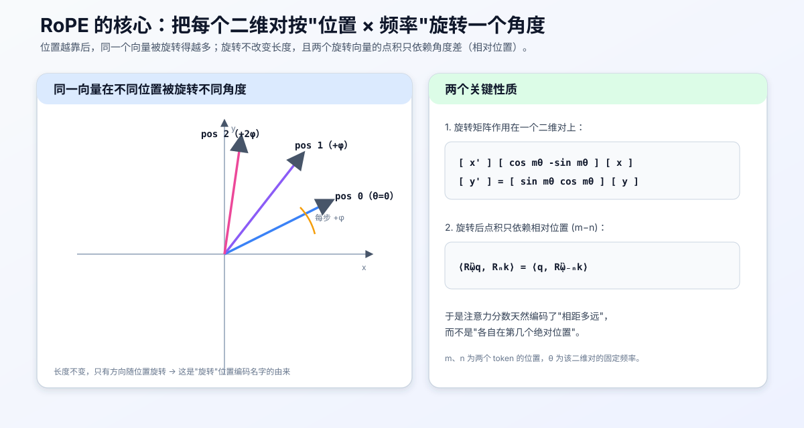
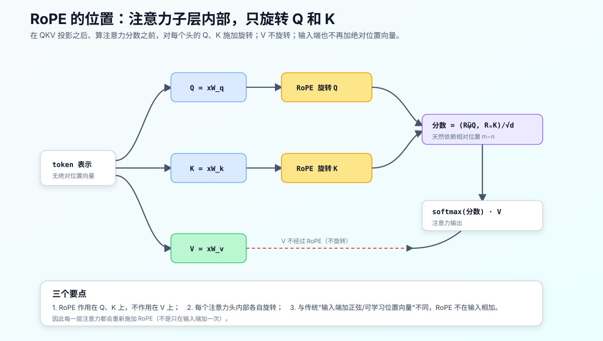
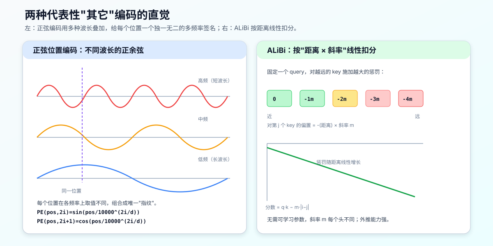

# RoPE 旋转位置编码：原理、性质，以及它在 LLM 中的位置

## 0. 本文目标与阅读方式

这份讲义系统讲清楚 **RoPE（Rotary Position Embedding，旋转位置编码）**：它要解决什么问题、核心思想是"旋转"、为什么旋转能编码**相对位置**，以及最实用的一个问题——**它在大语言模型里被放在什么位置、作用在哪些张量上**。

阅读顺序建议：

1. 第 1 节：位置编码到底为什么必要；
2. 第 2–3 节：RoPE 的核心思想（二维旋转）与它为什么天然编码相对位置；
3. 第 4 节：回答你最关心的问题——RoPE 在 LLM 中的位置（注意力子层内，只作用于 Q/K）；
4. 第 5–6 节：多频率设计、长上下文扩展、优缺点；
5. 第 7 节：把其它位置编码（正弦、可学习绝对、Shaw、T5、ALiBi、NoPE）逐一展开，并与 RoPE 对照。

本讲义与同目录的 [prenorm_vs_postnorm_explained.md](./prenorm_vs_postnorm_explained.md)、[glu_explained.md](./glu_explained.md)、[byte_level_bpe_worked_example.md](./byte_level_bpe_worked_example.md) 属于同一套 CS336 学习笔记。前两篇分别讲"归一化放哪"和"前馈子层怎么算"，本篇讲"位置信息怎么进注意力"，共同构成现代 LLM 层的核心组件。

> 说明：本文是概念讲解，不含任何作业实现代码。文中矩阵与点积表达式用于解释原理，不是可直接粘贴的作业答案。

---

## 1. 为什么需要位置编码

自注意力有一个根本特性：**它本身对顺序不敏感（置换等变）**。

注意力通过 $\langle q_i, k_j\rangle$ 计算 token $i$ 对 token $j$ 的关注度，这个点积只和两个向量的内容有关，**完全不知道它们谁在前、谁在后、相距多远**。如果把输入序列的 token 打乱，注意力的计算结构不会察觉——这对语言是致命的，因为"狗咬人"和"人咬狗"含义完全不同。

因此必须**额外注入位置信息**。历史上有几类做法：

1. **正弦位置编码（Sinusoidal）**：原始 Transformer 用固定的正弦/余弦向量，加到输入 embedding 上；
2. **可学习绝对位置编码（Learned Absolute）**：BERT/GPT-2 用一张可学习的"位置向量表"，按绝对位置查表相加；
3. **相对位置编码（Relative）**：直接建模"相距多远"，而非"各自在第几位"；
4. **RoPE**：本文主角，用"旋转"把**绝对位置的编码方式**变成**相对位置的注意力效果**，兼具前几类的优点。

RoPE 由苏剑林等人在 RoFormer（2021）中提出，如今是 LLaMA、PaLM、GPT-NeoX、Qwen 等绝大多数主流大模型的默认位置编码。

---

## 2. RoPE 的核心思想：按位置旋转

### 2.1 一句话概括

**RoPE 把向量按"二维对"分组，每一对都在它自己的平面里旋转一个角度，旋转角度 = token 的位置 × 该对的固定频率。**

不是"加"一个位置向量，而是"转"一个角度——这是 RoPE 与前几类方法最本质的区别。

### 2.2 二维情形

先看最简单的二维。设某个二维对为 $(x, y)$，token 在位置 $m$，该对的频率为 $\theta$。RoPE 用旋转矩阵作用在它上面：

$$ R_m \begin{bmatrix} x \\ y \end{bmatrix} = \begin{bmatrix} \cos m\theta & -\sin m\theta \\ \sin m\theta & \cos m\theta \end{bmatrix} \begin{bmatrix} x \\ y \end{bmatrix} $$

位置 $m$ 越大，旋转角 $m\theta$ 越大。**同一个向量，放在不同位置，会被转到不同方向，但长度不变。** 下图直观展示：



### 2.3 高维情形：拆成许多二维对

模型的每个头维度 $d$（偶数）被拆成 $d/2$ 个二维对：$(x_1,x_2), (x_3,x_4), \dots$。每一对用**各自的频率** $\theta_i$ 独立旋转。于是整个 RoPE 变换是一个分块对角的旋转矩阵，每个 $2\times2$ 块负责一个对。第 5 节会讲这些频率如何设定。

---

## 3. 关键性质：为什么旋转能编码"相对位置"

这是 RoPE 最漂亮的地方，值得单独讲透。

### 3.1 旋转的两个数学事实

**事实一：旋转保持长度和内积结构。** 旋转是正交变换，不改变向量模长，因此不会破坏原始表示的尺度。

**事实二（核心）：两个旋转向量的点积只依赖角度差。** 设 query 在位置 $m$、key 在位置 $n$，分别旋转后做点积：

$$ \langle R_m q,\; R_n k\rangle = \langle q,\; R_{m}^{\top}R_n\, k\rangle = \langle q,\; R_{n-m}\, k\rangle $$

注意最后只剩下 $n-m$——**两个 token 的相对距离**，而 $m$、$n$ 各自的绝对值消失了。

### 3.2 这意味着什么

- 我们在 **Q/K 上按绝对位置** $m$、$n$ 施加旋转（实现简单，每个 token 独立处理）；
- 但注意力分数 $\langle R_m q, R_n k\rangle$ **只依赖相对位置** $n-m$（获得相对位置的好处）。

也就是说，RoPE **用绝对位置的编码方式，得到了相对位置的注意力效果**。这兼具两者优点：实现上像绝对编码一样简单高效，语义上又是相对位置感知——对语言建模至关重要（"距离 3 个词"这种关系可以跨绝对位置复用）。

这也带来一个良好的**平移不变性**：整段文本整体后移若干位置，token 之间的注意力分数不变。

---

## 4. RoPE 在 LLM 中的位置

这是本文的重点问题。答案要点有三个：

1. **在哪个子层**：RoPE 用在**自注意力子层**内部（不在前馈子层 FFN）；
2. **作用在哪些张量**：只作用在 **Query 和 Key** 上，**不作用在 Value** 上；
3. **在什么时机**：在 **QKV 投影之后、计算注意力点积之前**，对每个注意力头**逐头**施加。

下图画出 RoPE 在注意力子层里的确切位置：



### 4.1 为什么只旋转 Q 和 K，不旋转 V

因为位置信息需要影响的是**"谁该关注谁"**，也就是注意力分数 $\langle q, k\rangle$。而 V 是被加权求和的"内容负载"，不参与打分。第 3.1 节的相对位置性质也只对 Q·K 的点积成立。所以旋转 Q、K 就够了，V 保持不变。

### 4.2 为什么每一层都要再施加一次

传统绝对位置编码是在**输入端加一次**，之后所有层共享。RoPE 不同：它不在输入端相加，而是**在每一层的注意力里、对当层的 Q/K 重新旋转**。因为 Q/K 是每层各自投影出来的新向量，需要各自带上位置信息。因此 RoPE 是一个贯穿所有注意力层的、"随算随转"的操作。

### 4.3 与"输入端加位置向量"的对比

- 正弦/可学习绝对编码：`输入 embedding + 位置向量`，是**加性的、一次性的**；
- RoPE：`对每层 Q/K 做旋转`，是**乘性的（旋转矩阵）、每层重复的**，且不额外占用可学习参数（频率是固定公式算出来的）。

---

## 5. 多频率设计与长上下文扩展

### 5.1 为什么要不同频率

如果所有二维对都用同一个旋转速度，模型只能感知单一尺度的位置。RoPE 让**不同的对转不同的速度**：

$$ \theta_i = \text{base}^{-2i/d}, \qquad i = 0, 1, \dots, \tfrac{d}{2}-1 $$

其中 base 常取 10000。$i$ 越大，频率越低、旋转越慢。于是：

- **高频对（转得快）**：位置每变化一点角度就转很多，擅长分辨**近距离**的细微位置差；
- **低频对（转得慢）**：要走很远位置才转一点，擅长表达**长距离**的位置关系。

多个频率组合起来，就得到多尺度的位置感知——类比一组转速不同的钟表指针：


这个"多频率"设计其实和正弦位置编码用不同波长是同一种智慧，只不过 RoPE 把它实现成了旋转角速度。

### 5.2 长上下文扩展

RoPE 的一个巨大工程红利是**便于外推到训练时没见过的更长序列**。因为位置是通过连续的旋转角表达的，可以通过调整频率来"拉伸"位置范围，主流方法有：

- **位置插值（Position Interpolation, PI）**：把超出训练长度的位置线性压缩回训练范围内；
- **NTK-aware scaling / YaRN**：主要调整**低频对**的频率，让模型在几乎不重训的情况下支持更长上下文。

这也是为什么很多模型能从 4K 上下文"低成本"扩展到 32K、128K——RoPE 的旋转形式给了这种可调节性。第 5.1 节图中最右侧的低频对，正是这些方法的主要作用对象。

---

## 6. 优点与缺点

**优点**

1. **相对位置感知**：注意力分数只依赖相对距离，符合语言的平移不变直觉；
2. **实现高效**：只是对 Q/K 做逐元素的 cos/sin 组合，无需构造大矩阵，也几乎不加参数；
3. **不改变向量长度**：正交旋转数值稳定，不干扰表示尺度；
4. **利于长度外推**：旋转形式天然支持位置插值 / NTK / YaRN 等长上下文扩展；
5. **与注意力解耦干净**：只动 Q/K，不影响 V、FFN、归一化等其他组件。

**缺点与注意点**

1. **要求维度成对**：头维度必须是偶数（按二维对分组）；
2. **纯外推仍有上限**：不做插值/缩放时，直接外推到远超训练长度会退化；
3. **实现细节易错**：对的配组方式（相邻配对 vs 折半配对）、频率 base、旋转施加顺序等需与推理端严格一致，否则结果错乱；
4. **主要是相对、缺少绝对锚点**：某些需要绝对位置的任务上，纯 RoPE 不如带绝对信息的方案直接。

---

## 7. 其它位置编码详解

前面第 1 节只是列了名字，这里把每一类展开讲清楚：它**怎么注入位置**、**是绝对还是相对**、**优缺点**，最后再和 RoPE 对照。先给一张全景图：


一个统一的看问题框架是问两个问题：

1. **编码的是绝对位置还是相对位置？**（"我在第几个" vs "我们相距多远"）
2. **位置信息注入在哪一步？**（加到输入 embedding / 加到注意力分数 / 旋转 Q,K / 完全不加）

下面逐一展开。

### 7.1 正弦位置编码（Sinusoidal，绝对）

**做法**：对位置 $pos$ 和维度下标 $i$，用一组不同波长的正弦、余弦生成固定向量，加到输入 embedding 上：

$$ \mathrm{PE}(pos, 2i) = \sin\!\big(pos / 10000^{2i/d}\big), \quad \mathrm{PE}(pos, 2i+1) = \cos\!\big(pos / 10000^{2i/d}\big) $$

低维用短波长（变化快），高维用长波长（变化慢），于是每个位置得到一个独一无二的"多频率指纹"。



**特点**：无需学习参数、可外推到更长位置；相邻位置编码相似，利于泛化。**局限**：它是绝对编码，模型要"间接"从两个绝对向量推断相对关系；实践中长程外推质量一般。

> 有趣的呼应：正弦编码"用多种波长覆盖多尺度"的思想，和 RoPE 的多频率（第 5 节）是同一种智慧——只不过正弦把它做成"加性波形"，RoPE 做成"旋转角速度"。

### 7.2 可学习绝对位置编码（Learned Absolute，绝对）

**做法**：维护一张可学习的位置向量表 $P \in \mathbb{R}^{L \times d}$，第 $pos$ 个位置查表得到 $P_{pos}$，加到输入 embedding 上。BERT、GPT-2、原始 ViT 都用它。

**特点**：简单、灵活，让模型自己学位置该长什么样。**局限**：

1. **无法超出训练长度**：位置表只有 $L$ 行，$pos \ge L$ 时没有对应向量，天然不能外推；
2. 仍是绝对编码，缺乏相对位置的平移不变性；
3. 占用可学习参数（虽然通常不多）。

### 7.3 Shaw 相对位置编码（Relative，2018）

这是**第一个把"相对位置"显式引入自注意力**的经典工作（Shaw et al. 2018），后续 T5、Transformer-XL、乃至 RoPE 都可视为对它的简化或改进，值得展开讲。

**核心动机**：绝对编码告诉模型"你在第 5 位、我在第 6 位"；但语言里更本质的往往是"你在我前面 1 位"。Shaw 的想法是：**不在输入端加位置，而是在注意力打分时，直接为"query 与 key 的相对距离"注入一个可学习向量。**

**做法（打分处）**：标准注意力分数是 $\text{score}_{ij} = q_i^\top k_j$。Shaw 给每个相对距离配一个**可学习的相对位置向量** $a^K_{j-i}$，加到 key 上再与 query 点积：

$$ \text{score}_{ij} = q_i^\top\big(k_j + a^K_{j-i}\big) = q_i^\top k_j + q_i^\top a^K_{j-i} $$

展开成两项很有启发：第一项 $q_i^\top k_j$ 是原来的**内容匹配**，第二项 $q_i^\top a^K_{j-i}$ 是**内容与相对距离的交互**——同一个距离 $j-i$ 对不同 query 内容可以有不同影响，这比一个固定标量偏置更有表达力。

**做法（value 处，可选）**：Shaw 原文还把相对信息加到 value 上（后续很多工作省略这一半以提速）：

$$ z_i = \sum_j \text{softmax}(\text{score}_{ij})\,\big(v_j + a^V_{j-i}\big) $$

**距离裁剪（关键工程点）**：相对距离理论上有 $2L-1$ 种取值（$-(L-1)$ 到 $L-1$），序列越长表越大。Shaw 把距离**裁剪**到窗口 $[-k, k]$，超出的都共享端点向量：

$$ a^K_{j-i} = P^K_{\text{clip}(j-i,\,k)}, \qquad \text{clip}(x, k) = \max(-k,\ \min(k,\ x)) $$

于是只需学习 $2k+1$ 个相对向量（存在一张查找表 $P^K \in \mathbb{R}^{(2k+1)\times d}$ 里，按裁剪后的相对距离索引）。这背后有个假设：**超过一定距离后，精确的相对位置不再重要**，统一归到"很远"即可。

举个小例子（$k=2$）：query 在位置 5，看不同 key：

```text
key 位置 j:    3    4    5    6    7    8    9
相对 j-i:     -2   -1    0   +1   +2   +3   +4
裁剪到 [-2,2]: -2   -1    0   +1   +2   +2   +2   ← j-i≥2 都用同一个向量
查表索引:      0    1    2    3    4    4    4
```

**共享范围**：这 $2k+1$ 个相对向量在**同一层内跨所有 query/key 位置共享**（这正是"相对"的含义——只认距离不认绝对位置）；不同层、不同头通常各自有自己的表。

**特点**：真正的相对位置、平移不变、表达力强（内容 × 距离交互）。**局限**：

1. **成本高**：要为注意力矩阵里**每个 (i, j) 对**取出并参与运算 $a_{j-i}$，多出一块与序列长度平方相关的计算/显存开销；
2. **仍需存参数**：查找表是可学习参数（虽然被 $k$ 限制住了规模）；
3. **窗口外不精细**：裁剪意味着远距离一律"看成同样远"。

**历史意义**：Shaw 开了"把相对位置放进注意力"的先河，但太重。**Transformer-XL（Dai et al. 2019）** 把打分重写成"内容-内容 + 内容-相对位置 + 两个全局偏置"四项、并用相对距离编码替代绝对项，大幅提效；**T5（7.4）** 进一步把相对信息压成一个标量偏置；**RoPE** 则彻底改用旋转、零额外参数地实现相对性。可以说 7.3→7.4→RoPE 是一条"**相对位置越做越便宜**"的主线。

### 7.4 T5 相对位置偏置（Relative bias，标量）

T5（Raffel et al. 2020）在 Shaw（7.3）的基础上做了一个大胆的简化：**既然相对位置最终只是想影响"打分高低"，那何必用向量？直接给注意力分数加一个可学习的标量就行。** 这一节把它讲透。

**核心公式**：注意力分数在原来的 $q_i\cdot k_j$ 之外，加一个只依赖相对距离的标量偏置 $b$：

$$ \text{score}_{ij} = \frac{q_i \cdot k_j}{\sqrt{d}} + b_{\text{bucket}(i-j)} $$

对比 Shaw 的 $q_i^\top a^K_{j-i}$（一个要和 query 做点积的**向量**），T5 的 $b$ 就是**一个数**，直接加到 logit 上，不参与任何点积。这是它便宜的根本原因。

**关键设计：对数分桶（logarithmic bucketing）**。如果每个相对距离配一个标量，长序列仍要很多参数。T5 的观察是：**近处需要分辨得细，远处可以粗糙**——"相邻 1 个"和"相邻 2 个"差别很大，但"相隔 100"和"相隔 130"几乎无所谓。于是它把相对距离映射进有限个"桶"：

- **近处**：小距离**一个距离一个桶**（精确分辨）；
- **远处**：大距离按**对数**合并，距离越大，一个桶覆盖的范围越宽；
- 超过最大距离 `max_distance` 的，全部塞进最后一个桶。

默认配置：`num_buckets = 32`、`max_distance = 128`。在 decoder 这类单向注意力里，只关心一侧（$i \ge j$），32 个桶里前若干个是"精确近距离"，其余按对数拉伸到 128。

**分桶直觉示例**（单向、示意）：

```text
相对距离 i-j:  0  1  2  3  4 ... 7 | 8-9  10-13  14-19 ... | ≥128
桶编号:        0  1  2  3  4 ... 7 |  8     9     10   ... |  31
              └── 近处：一距离一桶 ──┘ └─ 远处：对数合并越来越宽 ─┘ └最后一桶
```

每个桶学一个标量 $b$，按上面映射查表即可。

**参数量与共享范围**：

- 每个注意力**头**有自己的一套桶标量（不同头可学出不同的距离偏好——有的头偏爱近处、有的关注远处）；所以参数量约为 `层间共享? × num_heads × num_buckets`；
- T5 的一个显著特点：**相对位置偏置表在所有层之间共享**（只有第一层真正持有，其余层复用），进一步把参数压到极小；
- 偏置**与内容无关**：$b$ 只看距离，不看 $q$/$k$ 的内容——这是它比 Shaw 表达力弱的地方。

**为什么这么设计**：T5 想要一个"几乎零成本、又能表达相对位置、还能跨层共享"的方案。标量 + 对数分桶 + 层间共享三者合起来，让位置编码的参数量小到可以忽略，却仍带来相对位置感知。

**特点**：极其便宜（一张 `heads × 32` 的小表、跨层共享）、真正的相对、实现简单。**局限**：

1. **表达力有限**：偏置是标量且与内容无关，只能整体抬高/压低某个距离的分数，不能像 Shaw 那样让"距离对不同内容有不同影响"；
2. **远处粗糙**：对数分桶意味着远距离被合并，无法精细区分；
3. **外推一般**：超过 `max_distance` 的距离全落进同一个桶，再远也"看成一样远"，长度外推能力弱于 ALiBi/RoPE。

**一句话对比 Shaw**：Shaw 加的是**向量**（$q\cdot a$，内容相关、贵）；T5 加的是**标量**（$b$，内容无关、便宜）。这是"相对位置越做越便宜"这条主线上的关键一步，再往后 ALiBi 连"学"都省了（见 7.5）。

### 7.5 ALiBi（Attention with Linear Biases，2021）

**做法**：比 T5 更简单——**连学习都不用**。直接给分数减去一个"距离 × 斜率"的线性惩罚，越远扣得越多：

$$ \text{score}_{ij} = q_i \cdot k_j - m \cdot |i - j| $$

其中斜率 $m$ 是每个注意力头固定的超参数（不同头用不同斜率）。见上方右图。

**特点**：**零额外参数、外推能力很强**（因为惩罚是简单的线性外插），实现极简。**局限**：内置了"近处优先"的强归纳偏置，对需要远距离精确定位的任务不一定合适；灵活性不如 RoPE。

### 7.6 NoPE（不加显式位置编码）

**做法**：在 **decoder-only 因果模型**里，干脆**不加任何显式位置编码**。为什么还能工作？因为**因果 mask 本身已经打破了置换对称性**：每个位置只能看到自己和前面的 token，"能看到多少个前文"本身就隐含了位置信息，模型可以隐式学出顺序。

**特点**：近年研究发现 NoPE 在因果 LM 上能与显式编码相竞争，甚至外推不差。**局限**：只适用于因果（单向）注意力；双向 encoder 去掉位置编码会退化为置换不变，不可用。它更多是"理论上的有趣发现"和研究对象，主流生产模型仍用 RoPE。

### 7.7 汇总对照表

| 方法 | 注入方式 | 位置类型 | 注入位置 | 参数 | 长度外推 |
|---|---|---|---|---|---|
| 正弦 Sinusoidal | 加到输入 | 绝对 | 输入 embedding | 无 | 一般 |
| 可学习绝对 | 加到输入 | 绝对 | 输入 embedding | 有（位置表） | 差（超表长无定义） |
| Shaw 相对 | 加相对向量到 K/V | 相对 | 注意力内部 | 有 | 中等，成本高 |
| T5 相对偏置 | 给分数加标量 | 相对 | 注意力打分处 | 有（小） | 中等 |
| ALiBi | 给分数加线性惩罚 | 相对 | 注意力打分处 | 无 | 好 |
| NoPE | 不注入（靠因果 mask） | 隐式 | —— | 无 | 好（仅因果模型） |
| **RoPE** | **旋转 Q/K** | **相对（由绝对实现）** | **注意力子层内 Q/K** | 无 | **好（可插值/NTK/YaRN）** |

几个值得记住的对照：

- **绝对 vs 相对**：正弦、可学习绝对是"你在第几位"；Shaw、T5、ALiBi、RoPE 是"我们相距多远"。语言更在意后者。
- **加性 vs 乘性**：几乎所有旧方法都是"加"（加向量或加偏置到分数）；**RoPE 是唯一主流的"乘性（旋转）"方案**，这让它既有相对性，又保持向量长度与数值稳定。
- **ALiBi vs RoPE**：**ALiBi 是"给远处打分做减法惩罚"，RoPE 是"给 Q/K 做旋转"**；都实现相对位置，但 ALiBi 自带近处偏好，RoPE 更中性、更灵活、可调频扩展。

RoPE 正是因为兼顾了相对位置、实现高效、数值稳定与长度可扩展，才在这一众方法中成为当前主流。

---

## 8. 小结：一页纸记住 RoPE

1. **要解决什么**：自注意力本身对顺序不敏感，必须注入位置信息。
2. **核心思想**：把向量按二维对分组，每对旋转一个"位置 × 频率"的角度——旋转，而非相加。
3. **为什么妙**：旋转后点积 $\langle R_m q, R_n k\rangle$ 只依赖相对位置 $n-m$，用绝对编码方式得到相对位置效果。
4. **在 LLM 的位置**：**自注意力子层内部**，在 QKV 投影后、打分前，**只旋转 Q 和 K（不旋转 V）**，且**每一层都重新施加**。
5. **多频率 + 可扩展**：不同对不同转速，覆盖多尺度距离；旋转形式便于用 PI/NTK/YaRN 扩展长上下文。
6. **当代标配**：与 Pre-Norm、RMSNorm、SwiGLU 一起，构成现代 LLM 的"标准组件套"。

配套三张图对应三个层次：
[二维旋转核心](./images/rope_rotation_2d.svg) → [在注意力中的位置](./images/rope_position_in_attention.svg) → [多频率设计](./images/rope_frequency_bands.svg)。

---

## 参考文献（用于延伸阅读）

1. Su et al., *RoFormer: Enhanced Transformer with Rotary Position Embedding*, 2021（RoPE 提出）。
2. Vaswani et al., *Attention Is All You Need*, 2017（正弦位置编码）。
3. Shaw et al., *Self-Attention with Relative Position Representations*, 2018（相对位置编码）。
4. Press et al., *Train Short, Test Long: Attention with Linear Biases (ALiBi)*, 2021（对照方法）。
5. Raffel et al., *Exploring the Limits of Transfer Learning with a Unified Text-to-Text Transformer (T5)*, 2020（相对位置偏置）。
6. Chen et al., *Extending Context Window via Position Interpolation*, 2023（位置插值）。
7. Peng et al., *YaRN: Efficient Context Window Extension of Large Language Models*, 2023（长上下文扩展）。
8. Kazemnejad et al., *The Impact of Positional Encoding on Length Generalization in Transformers*, 2023（NoPE 分析）。
9. Touvron et al., *LLaMA*, 2023（RoPE 的工业实践）。
