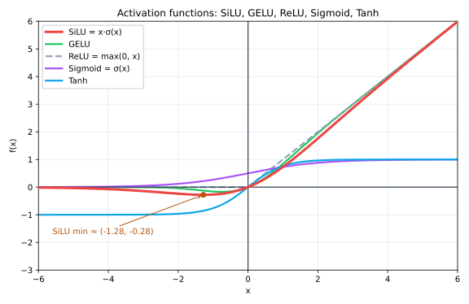

# 实现 SwiGLU 前馈网络：原理、结构与验证

## 0. 本文目标

记录 CS336 assignment1 里 **SwiGLU** 前馈层（及其依赖的 **SiLU**）的实现思路：它算什么、三个权重矩阵各是什么角色、怎么用已实现的 `Linear` 拼出来、adapter 怎么接到测试。

对应实际代码：
- 实现：[cs336_basics/model.py](../cs336_basics/model.py) 的 `silu` 与 `SwiGLU`
- 接线：[tests/adapters.py](../tests/adapters.py) 的 `run_silu`、`run_swiglu`
- 测试：[tests/test_model.py](../tests/test_model.py) 的 `test_silu_matches_pytorch`、`test_swiglu`

SwiGLU/GLU 的**原理与背景**（为什么门控、为什么是 FFN 的位置、2/3 缩放等）已在 [glu_explained.md](./glu_explained.md) 详述，本文聚焦实现，原理只做必要回顾。

---

## 1. 背景速览：SiLU 与 SwiGLU

### 1.1 SiLU（Swish）

逐元素激活，无参数：

$$ \mathrm{SiLU}(x) = x \cdot \sigma(x), \qquad \sigma(x)=\frac{1}{1+e^{-x}} $$

平滑、有下界、非单调，是 SwiGLU 门支路用的激活。实现就是 `x * torch.sigmoid(x)`（PyTorch 也有 `F.silu`，效果一致）。

下图把 SiLU 和几个常见激活/门函数画在同一坐标系里对比：



读图要点：

- **SiLU（红）**：负半轴不是全 0，在 $x\approx-1.28$ 处有个小凹陷（极小值约 $-0.28$），这就是"非单调、有下界"；$x$ 较大时趋近 $y=x$（像 ReLU），$x$ 很负时趋近 0。
- **GELU（绿）**：与 SiLU 形状几乎重合，都是"平滑版 ReLU"，这也是为什么 GEGLU 和 SwiGLU 效果接近。
- **ReLU（灰虚线）**：$\max(0,x)$，在 0 处有折点、负区硬为 0，不平滑。
- **Sigmoid（紫）/ Tanh（蓝）**：有界的 S 形曲线，取值压在 $(0,1)$ / $(-1,1)$，适合当"门"用；SiLU 正是用 $\sigma(x)$ 当门乘回 $x$。

### 1.2 SwiGLU 前馈

> **关键区分：SwiGLU 是完整的 FFN 子层，不是激活函数。** SiLU 才是激活函数（逐元素、无参数）；SwiGLU 是用 SiLU 搭起来的**一整层**，含三个可学习权重 $W_1,W_2,W_3$，在 Transformer 里替换标准 FFN 的整体位置。层级关系是：`FFN 子层 = SwiGLU（含 W1/W2/W3）`，其内部**用到** SiLU 作为门激活。命名上 SwiGLU = **Swi**sh(=SiLU) + **GLU**，读起来像激活名，实指"用 Swish 当门的 GLU 型前馈层"。代码里也印证：`SwiGLU` 是带参数的 `nn.Module`，`silu` 只是无参数函数——前者是"层"，后者是"零件"。

SwiGLU 是把 Transformer 的前馈子层（FFN）做成**门控**形式。它用**三个**线性矩阵：

$$ \mathrm{FFN}(x) = W_2\Big(\mathrm{SiLU}(W_1 x) \odot (W_3 x)\Big) $$

- $W_1 x$：**门支路**，过 SiLU 变成"开关"；
- $W_3 x$：**值支路**，不激活；
- $\odot$：逐元素相乘（门控值）；
- $W_2$：把结果降回 `d_model`。

对比标准 FFN（`W2·act(W1·x)`，两矩阵），SwiGLU 多一个 $W_3$，用乘性门控换取更强表达力（详见 glu 笔记）。

**展开对比（不用跳去 glu 笔记）：**

标准 FFN 的结构是"升维 → 激活 → 降维"，两个矩阵、一条主路：

$$ \mathrm{FFN}_{\text{标准}}(x) = W_2\,\mathrm{act}(W_1 x) $$

激活（ReLU/GELU）**直接套在主路上**，对每个神经元做固定的、逐点的非线性。

SwiGLU 则把这条主路拆成**两条并行支路再相乘**，三个矩阵：

$$ \mathrm{SwiGLU}(x) = W_2\big(\underbrace{\mathrm{SiLU}(W_1 x)}_{\text{门}} \odot \underbrace{W_3 x}_{\text{值}}\big) $$

两者的本质差别在于**加性 vs 乘性**：

| | 标准 FFN | SwiGLU |
|---|---|---|
| 矩阵数 | 2（$W_1,W_2$） | 3（$W_1,W_2,W_3$） |
| 非线性方式 | 激活直接套主路（**加性**、逐点固定） | 门支路激活后**乘**值支路（**乘性**、输入依赖） |
| 中间维 $d_{ff}$ | 常取 $4d$ | 常缩到约 $\tfrac{2}{3}\times 4d$ 以对齐参数量 |
| 表达力 | 基线 | 乘性交互更强，相同预算下通常更优 |

**为什么"多一个 $W_3$、改成乘法"就更强？** 关键是 $W_1 x$ 与 $W_3 x$ 的**乘性交互**：门支路 $\mathrm{SiLU}(W_1 x)$ 逐通道地决定"值支路 $W_3 x$ 的每个通道放行多少"。这让网络能表达"**当某特征出现时才让另一特征通过**"这类条件逻辑——标准 FFN 只有加性组合 + 固定激活，做不到这种输入依赖的动态门控。

**代价**：多一个矩阵会多约 50% 的 FFN 参数，所以工程上把中间维 $d_{ff}$ 缩到约 $\tfrac{2}{3}$，让 SwiGLU 与标准 FFN 在**相同参数/算力预算**下比较——这才公平，也正是 LLaMA 等模型 $d_{ff}$ 不是整齐 $4d$ 的原因。（更完整的推导见 [glu_explained.md](./glu_explained.md)，但上面已足够理解本实现。）

> 记号（仓库规则 R1/R2）：数学上以列向量记 $W_1 x$；PyTorch 中特征在最后一维、实现为 $x W_1^\top$。下面用 `Linear` 封装，二者自动对上。

---

## 2. 逐个决定的理由

### 2.1 权重形状与角色（来自 handout / 测试契约）

| 权重 | 形状 | 角色 | 对应 Linear |
|---|---|---|---|
| `w1` | `(d_ff, d_model)` | 门支路升维 | `Linear(d_model, d_ff)` |
| `w3` | `(d_ff, d_model)` | 值支路升维 | `Linear(d_model, d_ff)` |
| `w2` | `(d_model, d_ff)` | 降维回 d_model | `Linear(d_ff, d_model)` |

关键点：`Linear` 的 weight 形状是 `(d_out, d_in)`（见 [linear 笔记](./linear_implementation_notes.md)），恰好与 handout 给的 `w1/w2/w3` 形状**一一对应**——所以能直接用三个 `Linear` 拼，无需任何转置。

### 2.2 用 `Linear` 复用，而不是裸 `nn.Parameter`

`SwiGLU` 内部声明三个子模块 `self.w1/w2/w3 = Linear(...)`。好处：

1. **复用已验证的 `Linear`**（含无 bias、$xW^\top$、autograd）；
2. 子模块的参数自动登记为 `SwiGLU` 的参数（`nn.Module` 树，见 [nn_module 笔记](./nn_module_and_linear_explained.md)）；
3. `state_dict` 的键自然是 `w1.weight`、`w2.weight`、`w3.weight`——与官方权重命名一致，加载不用改名。

### 2.3 `forward` 一行

```python
return self.w2(silu(self.w1(x)) * self.w3(x))
```

直译公式：门支路 `w1(x)` 过 `silu`，与值支路 `w3(x)` 逐元素相乘，再 `w2` 降维。`silu` 写成模块级函数（无参数、无需建类）。

### 2.4 SiLU 为什么不做成类

它没有可学习参数、纯逐元素，做成普通函数 `silu(x)` 最简洁；需要当层用时也能直接调。`run_silu` 直接转发它即可。

### 2.5 是否手写 backward

不需要。`sigmoid`、乘法、以及 `Linear` 内部的矩阵乘都是可微算子，autograd 自动求导（同 [linear 笔记 2.6](./linear_implementation_notes.md)）。

---

## 3. adapter 怎么接到测试

**`run_silu`**：直接 `return silu(in_features)`。测试 `test_silu_matches_pytorch` 会拿它和 PyTorch 的 `F.silu` 对比，数值一致即过。

**`run_swiglu`** 三步：

1. 构造 `SwiGLU(d_model, d_ff, device=..., dtype=...)`；
2. `load_state_dict({"w1.weight": w1, "w2.weight": w2, "w3.weight": w3})`——键名对应内部三个子 `Linear`；
3. 返回 `swiglu(in_features)`。

`test_swiglu` 用官方 `layers.0.ffn.{w1,w2,w3}.weight` 作参考权重、`in_embeddings` 作输入，输出与 `_snapshots/test_swiglu.npz` 比对（`atol=1e-5`）。

---

## 4. 为什么测试能过

三矩阵形状与 `Linear` 精确对应、`forward` 直译标准 SwiGLU 公式、权重来自外部，故输出与快照一致。链路：

```text
test_swiglu → run_swiglu(装入 w1/w2/w3) → SwiGLU.forward = w2( silu(w1 x) ⊙ w3 x )
           → numpy_snapshot 对照 _snapshots/test_swiglu.npz → PASS
```

运行：

```sh
uv run pytest -k "test_swiglu or test_silu"
```

预期 `2 passed`。

---

## 5. 小结

1. **SiLU**：`x * sigmoid(x)`，逐元素无参数，做成函数即可。
2. **SwiGLU**：$W_2(\mathrm{SiLU}(W_1 x)\odot W_3 x)$——门控 FFN，三矩阵。
3. **形状对应**：`w1/w3=(d_ff,d_model)`、`w2=(d_model,d_ff)`，与 `Linear` 的 `(d_out,d_in)` 精确匹配，用三个 `Linear` 直接拼、无需转置。
4. **复用 + 命名**：内部用子 `Linear`，`state_dict` 键为 `w1.weight` 等，与官方一致。
5. **backward 自动**：全可微算子。

---

## 参考

- 本仓库实现：[cs336_basics/model.py](../cs336_basics/model.py)
- 适配层：[tests/adapters.py](../tests/adapters.py)
- 测试：[tests/test_model.py](../tests/test_model.py)
- 原理背景：[glu_explained.md](./glu_explained.md)（GLU/SwiGLU 门控原理、FFN 位置、2/3 缩放）
- 配套：[linear_implementation_notes.md](./linear_implementation_notes.md)、[rmsnorm_implementation_notes.md](./rmsnorm_implementation_notes.md)
